# Mermaid Diagram Generation

Create professional diagrams using Mermaid syntax. This skill handles:
- Creating diagrams from text descriptions or requirements
- Converting ASCII art to Mermaid
- All Mermaid diagram types
- **Verification that diagrams render correctly**

## CRITICAL: Verification Step

**ALWAYS verify diagrams render before completing the task.**

After creating or modifying any Mermaid diagram, run this verification:

```bash
# Create temp file with the diagram
cat << 'MERMAID_EOF' > /tmp/mermaid-test.mmd
<paste diagram content here>
MERMAID_EOF

# Verify it parses correctly (will output errors if invalid)
npx -y @mermaid-js/mermaid-cli mmdc -i /tmp/mermaid-test.mmd -o /tmp/mermaid-test.svg 2>&1
```

**If verification fails:**
1. Read the error message carefully
2. Fix the syntax issue (common problems listed below)
3. Re-verify until it passes
4. Only then consider the diagram complete

### Common Verification Errors and Fixes

| Error | Cause | Fix |
|-------|-------|-----|
| `Parse error` | Invalid syntax | Check brackets, arrows, quotes |
| `Unexpected token` | Special chars in labels | Wrap label in quotes: `["Label"]` |
| `Unknown diagram type` | Typo in diagram type | Use exact: `flowchart`, `sequenceDiagram`, etc. |
| `Unterminated string` | Missing closing quote | Ensure all `"` are paired |
| `Invalid direction` | Wrong flowchart direction | Use: `TD`, `TB`, `BT`, `LR`, `RL` |

## Diagram Types Reference

### Flowchart (most common)
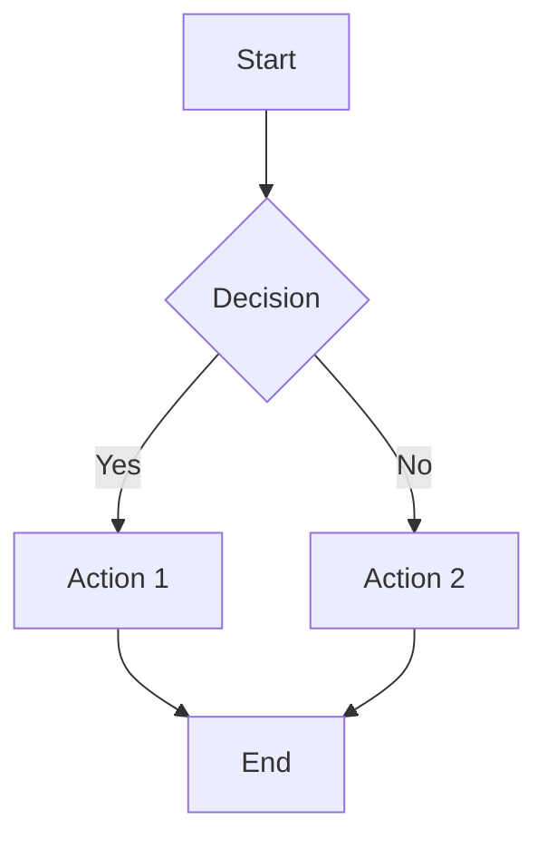

**Node shapes:**
- `[text]` - Rectangle
- `(text)` - Rounded rectangle
- `{text}` - Diamond (decision)
- `((text))` - Circle
- `[[text]]` - Subroutine
- `[(text)]` - Cylinder (database)
- `{{text}}` - Hexagon

**Directions:** `TD` (top-down), `TB`, `BT`, `LR` (left-right), `RL`

### Sequence Diagram
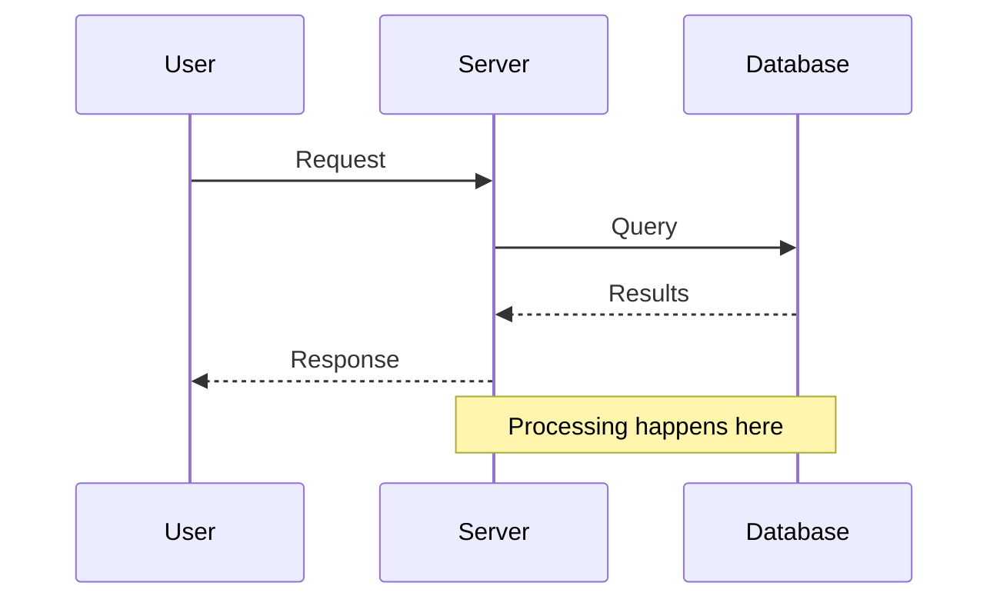

**Arrow types:**
- `->` solid line
- `-->` dotted line
- `->>` solid with arrowhead
- `-->>` dotted with arrowhead
- `-x` solid with X
- `--x` dotted with X

### Block Diagram (for boxes/containers)
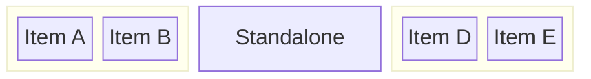

### Architecture Diagram
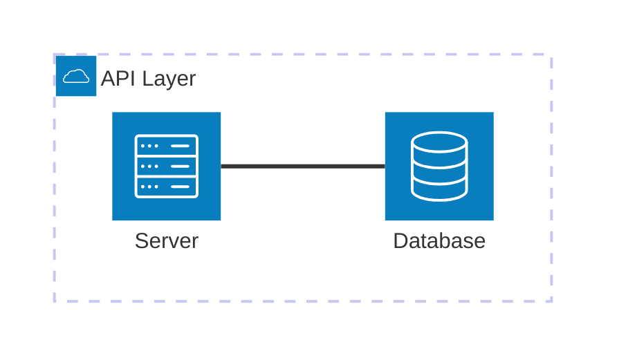

### Class Diagram
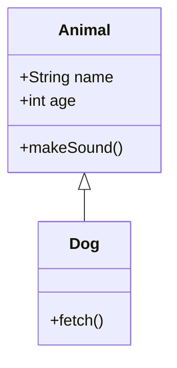

### State Diagram
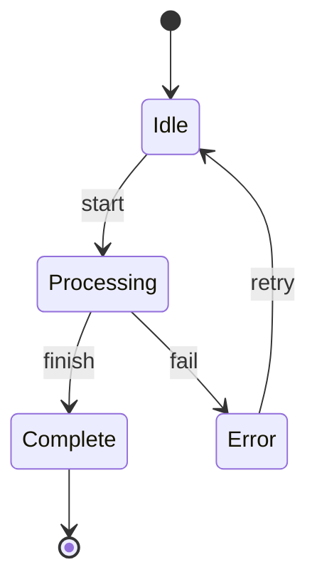

### Entity Relationship
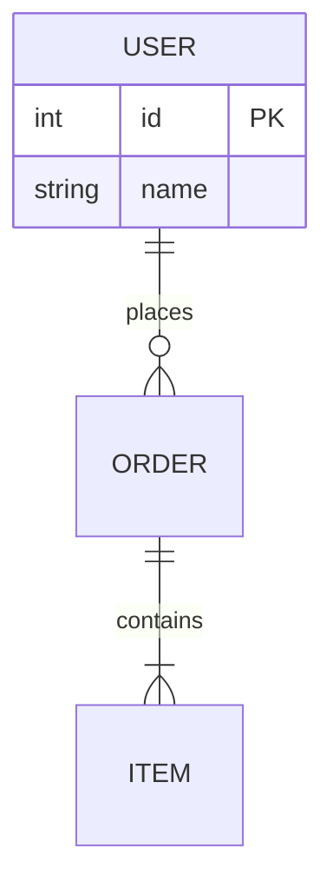

### Gantt Chart
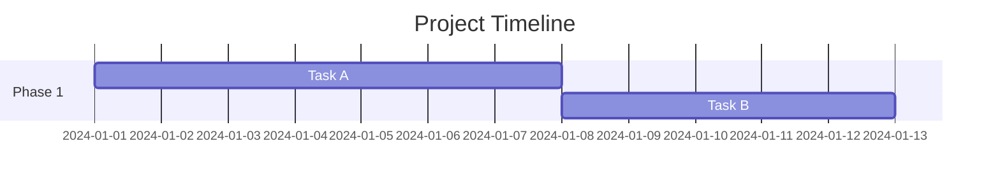

### Pie Chart
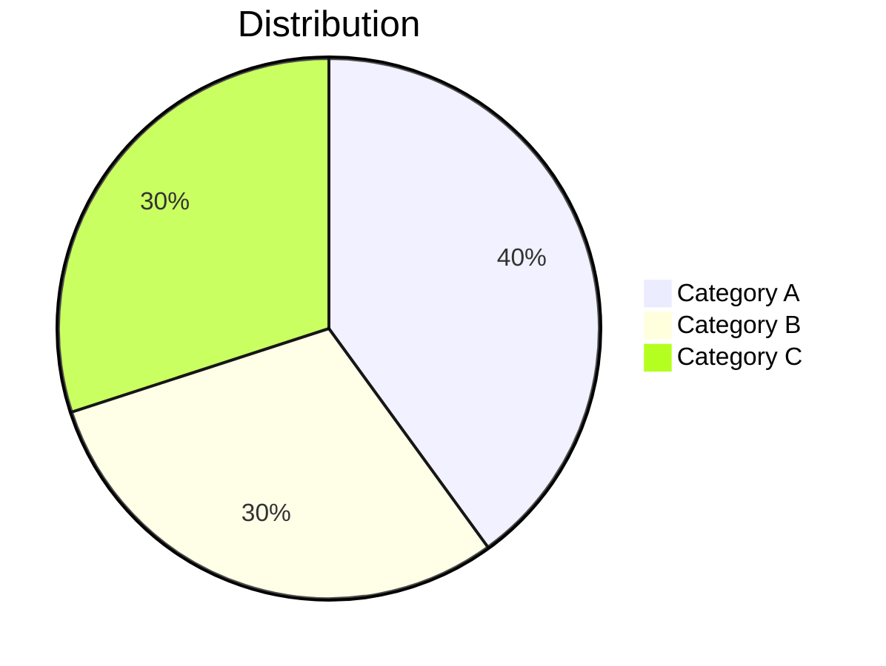

## Converting ASCII Art

When converting ASCII box diagrams:

1. **Identify the structure type:**
   - Boxes with arrows → `flowchart`
   - Sequential steps with participants → `sequenceDiagram`
   - Nested boxes/containers → `block-beta`
   - Tables with relationships → `erDiagram`

2. **Extract content:**
   - Box titles become node labels
   - Arrows become connections
   - Text inside boxes becomes node content

3. **Map ASCII elements:**
   | ASCII | Mermaid |
   |-------|---------|
   | `┌───┐` box | `[label]` node |
   | `→` or `──▶` | `-->` arrow |
   | `│` vertical | subgraph or sequence |
   | Nested boxes | `subgraph` or `block` |

## Best Practices

1. **Keep it simple** - Mermaid renders better with fewer elements
2. **Use subgraphs** for grouping related items
3. **Label edges** when the relationship isn't obvious
4. **Use consistent direction** - usually TD or LR
5. **Escape special characters** in labels with quotes: `["Label with (parens)"]`

## Styling

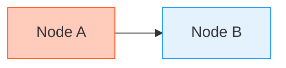

## Common Patterns

### Parent-Child Delegation
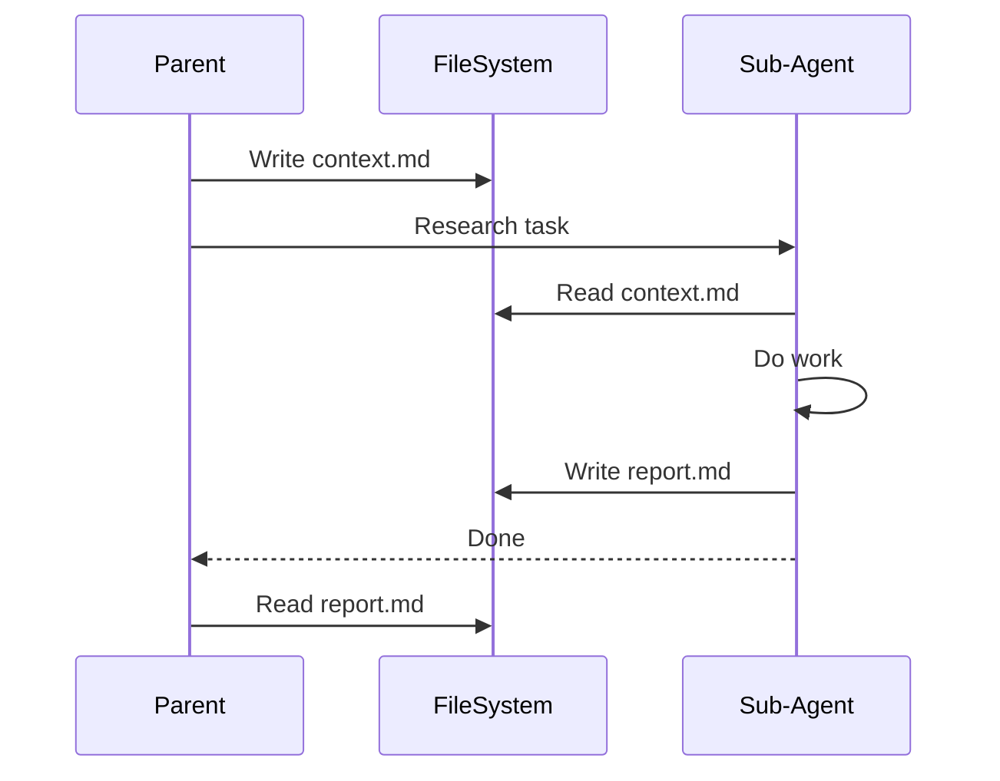

### Architecture Layers
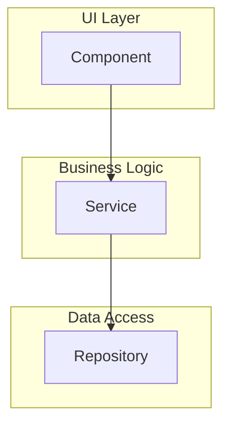

### Decision Flow
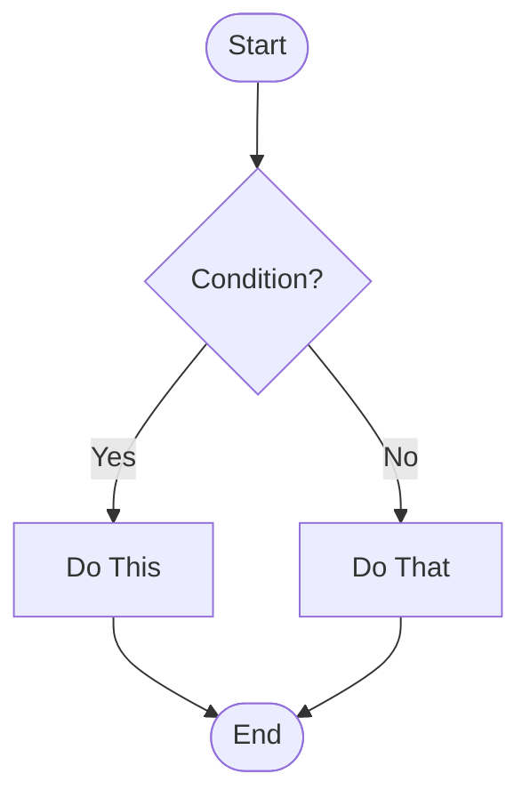

## Complete Workflow

**Follow this workflow for every diagram task:**

1. **Understand the requirement**
   - Read any source content (ASCII art, description, existing diagram)
   - Identify the appropriate diagram type

2. **Create the diagram**
   - Write the Mermaid syntax
   - Follow best practices (simple, labeled, consistent direction)

3. **Verify the diagram renders** (REQUIRED)
   ```bash
   cat << 'MERMAID_EOF' > /tmp/mermaid-test.mmd
   flowchart TD
       A[Your] --> B[Diagram]
   MERMAID_EOF
   npx -y @mermaid-js/mermaid-cli mmdc -i /tmp/mermaid-test.mmd -o /tmp/mermaid-test.svg 2>&1
   ```

4. **Fix any errors**
   - If verification fails, fix the syntax
   - Re-run verification until it passes

5. **Write the diagram to file**
   - Only after verification passes
   - Use `.mmd` extension for standalone files
   - Or embed in markdown with ` ```mermaid ` fence

6. **Confirm completion**
   - Report the verification result to the user
   - Include the file path where the diagram was saved
