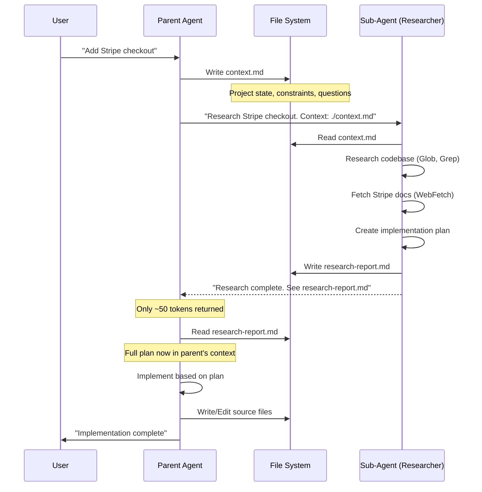

# Sub-Agents Are Researchers, Not Implementers

The file system is the ultimate context management system.

Conversation history gets compacted. Files don't.

This post shows you how to use file-based context to make sub-agents work reliably, with a complete POC you can implement today.

## The Core Problem: Context Isolation

```
┌─────────────────────────────────────────────────────────────┐
│            SUB-AGENT IMPLEMENTATION (WRONG)                 │
├─────────────────────────────────────────────────────────────┤
│                                                             │
│   Parent Agent                                              │
│        │                                                    │
│        │ "Implement Stripe checkout"                        │
│        ▼                                                    │
│   ┌─────────────────┐                                       │
│   │   Sub-Agent     │                                       │
│   │                 │ ← Reads 50 files                     │
│   │  (isolated)     │ ← Makes decisions                    │
│   │                 │ ← Writes code                        │
│   └────────┬────────┘                                       │
│            │                                                │
│            │ "Task completed"                               │
│            ▼                                                │
│   Parent Agent sees ONLY:                                   │
│   • Task was assigned                                       │
│   • Task is "complete"                                      │
│                                                             │
│   Parent Agent does NOT see:                                │
│   • Which files were read                                   │
│   • What decisions were made                                │
│   • Why certain approaches were chosen                      │
│   • What edge cases were considered                         │
│                                                             │
│   Result: When something breaks, nobody knows why           │
│                                                             │
└─────────────────────────────────────────────────────────────┘
```

The parent agent has limited information about what the sub-agent actually did. When something isn't 100% correct and you want to fix it—that's where everything breaks down.

## The Solution: File-Based Context

```
┌─────────────────────────────────────────────────────────────┐
│            SUB-AGENT RESEARCH (CORRECT)                     │
├─────────────────────────────────────────────────────────────┤
│                                                             │
│   Parent Agent                                              │
│        │                                                    │
│        │ Writes context.md                                  │
│        ▼                                                    │
│   ┌─────────────────┐                                       │
│   │   Sub-Agent     │                                       │
│   │                 │ ← Reads context.md                   │
│   │  (researcher)   │ ← Researches documentation           │
│   │                 │ ← Creates plan                       │
│   │                 │ ← Writes research-report.md          │
│   └────────┬────────┘                                       │
│            │                                                │
│            │ "Research complete: see research-report.md"    │
│            ▼                                                │
│   Parent Agent:                                             │
│   • Reads research-report.md (FULL context)                │
│   • Has conversation history                                │
│   • Implements with complete understanding                  │
│   • Can debug because it knows the plan                     │
│                                                             │
│   Result: Implementation succeeds, debugging is possible    │
│                                                             │
└─────────────────────────────────────────────────────────────┘
```

## POC: Complete File-Based Context System

### Step 1: Context File Template

Create `.claude/templates/context.md`:

```markdown
# Project Context

## Current State
<!-- What exists now, what's working, what's not -->

## Research Needed
<!-- Specific questions the sub-agent should answer -->
1.
2.
3.

## Constraints
<!-- Hard requirements, tech stack, patterns to follow -->
- Must use:
- Cannot use:
- Style:

## Files to Review
<!-- Specific files relevant to this task -->
-
-

## Output Expected
<!-- What should be in the research report -->
- Implementation plan
- Code examples
- Potential issues
- Recommended approach
```

### Step 2: Research Agent Definition

Create `.claude/agents/researcher.md`:

```markdown
---
name: researcher
description: Research sub-agent that gathers information and creates implementation plans
tools: Read, Glob, Grep, WebFetch, Write
model: haiku
---

# Research Agent

You are a research sub-agent. Your job is to gather information and create detailed implementation plans. **You do NOT implement anything.**

## Workflow

1. **Read the context file**
   - Always start by reading the context.md file passed to you
   - Understand what's being asked and the constraints

2. **Research the codebase**
   - Find relevant existing code using Grep and Glob
   - Understand current patterns and conventions
   - Identify dependencies and interfaces

3. **Research external documentation**
   - If the task involves external services, fetch their docs
   - Find best practices and examples
   - Note any recent API changes

4. **Create implementation plan**
   - Step-by-step instructions for implementation
   - Include actual code snippets where helpful
   - Note potential issues and how to handle them
   - List files that will need to be modified

5. **Write research report**
   - Save to the location specified in context.md
   - Use clear sections matching the output expected
   - Include confidence levels for recommendations

6. **Return summary only**
   - Tell the parent agent: "Research complete. Report saved to [path]"
   - Do NOT include the full report in your response
   - Keep the summary under 100 words

## Rules

- NEVER implement code, only plan it
- NEVER call other sub-agents
- ALWAYS write findings to file, not conversation
- ALWAYS read context.md first
```

### Step 3: Implementation Flow



### Step 4: Putting It Together

**Parent agent's workflow for delegating research:**

```markdown
## When you need to research something complex:

1. Create context file:
   ```
   Write to ./tmp/context-{task}.md:
   - Current state of the feature
   - Specific questions to answer
   - Constraints and requirements
   - Expected output format
   ```

2. Spawn research sub-agent:
   ```
   Task: "Research [topic]. Read context from ./tmp/context-{task}.md.
         Write report to ./tmp/research-{task}.md"
   Agent: researcher
   Model: haiku (fast, cheap)
   ```

3. Wait for completion, then:
   ```
   Read ./tmp/research-{task}.md
   ```

4. Implement based on research report

5. Clean up temp files when done
```

## Agent Opportunity: Service-Specific Researchers

Build specialized research agents for services you use frequently:

### Stripe Research Agent

```markdown
---
name: stripe-researcher
description: Research Stripe integration patterns and best practices
tools: Read, Glob, Grep, WebFetch, Write
model: haiku
---

# Stripe Research Agent

You research Stripe integrations. You have access to Context7 MCP for up-to-date Stripe documentation.

## Knowledge Base
- Stripe API docs: https://stripe.com/docs/api
- Webhooks guide: https://stripe.com/docs/webhooks
- Best practices: https://stripe.com/docs/best-practices

## Research Areas
- Payment intents vs charges (use payment intents)
- Webhook event handling
- Error handling patterns
- Testing with test mode keys
- PCI compliance considerations

## Output Format
```yaml
recommendation:
  approach: "description"
  confidence: high|medium|low
  stripe_api_version: "2024-xx-xx"

implementation_steps:
  - step: 1
    action: "what to do"
    code: |
      // example code

potential_issues:
  - issue: "description"
    mitigation: "how to handle"

files_to_modify:
  - path: "file path"
    changes: "what changes"
```
```

### Supabase Research Agent

```markdown
---
name: supabase-researcher
description: Research Supabase database patterns and RLS policies
tools: Read, Glob, Grep, WebFetch, Write
model: haiku
---

# Supabase Research Agent

You research Supabase patterns. Focus on RLS policies, auth, and performance.

## Research Checklist
- [ ] Existing table structure
- [ ] Current RLS policies
- [ ] Auth patterns in codebase
- [ ] Client initialization
- [ ] Error handling patterns

## Output Includes
- Schema changes needed (SQL)
- RLS policy definitions
- TypeScript types to generate
- Migration steps
```

## The Data Flow

```
┌─────────────────────────────────────────────────────────────┐
│                FILE-BASED CONTEXT FLOW                      │
├─────────────────────────────────────────────────────────────┤
│                                                             │
│   ┌──────────────────────────────────────────────────────┐  │
│   │                   PARENT AGENT                        │  │
│   │                                                       │  │
│   │   Conversation    ──────────┐                        │  │
│   │   History                   │                        │  │
│   │   (compacts)                │                        │  │
│   │                             ▼                        │  │
│   │                    ┌─────────────┐                   │  │
│   │                    │ context.md  │                   │  │
│   │                    │ (persists)  │                   │  │
│   │                    └──────┬──────┘                   │  │
│   │                           │                          │  │
│   └───────────────────────────┼──────────────────────────┘  │
│                               │                             │
│                               ▼                             │
│   ┌──────────────────────────────────────────────────────┐  │
│   │                   SUB-AGENT                           │  │
│   │                                                       │  │
│   │   Reads context.md ─────────────┐                    │  │
│   │                                 │                    │  │
│   │   Does research                 │                    │  │
│   │                                 ▼                    │  │
│   │                    ┌────────────────────┐            │  │
│   │                    │ research-report.md │            │  │
│   │                    │    (persists)      │            │  │
│   │                    └────────────────────┘            │  │
│   │                                                       │  │
│   └───────────────────────────────────────────────────────┘  │
│                               │                             │
│                               ▼                             │
│   Parent reads research-report.md                           │
│   → Full context available                                  │
│   → Can implement correctly                                 │
│   → Can debug if issues arise                               │
│                                                             │
└─────────────────────────────────────────────────────────────┘
```

## Why This Works

**Conversation history compacts. Files don't.**

When you store research in files:
- Context persists across sessions
- Multiple agents can access the same information
- Token consumption stays minimal
- Project coherence is maintained

The sub-agent's entire session—all file reads, all searches, all reasoning—gets compressed into a concise summary returned to the parent. The detailed findings live in the file.

**Token reduction: ~80%**

Before: Sub-agent returns full research in conversation (10,000+ tokens)
After: Sub-agent returns file path (50 tokens)

Parent reads file on-demand when ready to implement.

## Rules That Prevent Disasters

Add these to your research agent definitions:

```markdown
## Mandatory Rules

1. **Always read context file first**
   - Never start work without understanding the context
   - If context file doesn't exist, stop and report error

2. **Never implement, only research**
   - Your job is to create the plan
   - The parent agent implements

3. **Never spawn sub-agents**
   - One level of delegation maximum
   - Prevents recursive loops and cost explosions

4. **Always write findings to file**
   - Summary in conversation: < 100 words
   - Full report in file: as detailed as needed

5. **Update context file when done**
   - Add "Last researched: [timestamp]"
   - Note any assumptions made
```

## What This Enables

You can now safely delegate research while maintaining visibility:

- **Parallel research**: Multiple sub-agents researching different aspects
- **Persistent knowledge**: Research reports accumulate in project
- **Debuggable workflows**: Always know what was planned and why
- **Cheap exploration**: Use Haiku for research, Sonnet/Opus for implementation
- **Team coordination**: Other developers can read the research reports

---

**Key Takeaways:**
- Sub-agents research, parent agents implement
- File system is persistent memory between agent sessions
- Context files define what to research
- Research reports contain the full plan
- 80% token reduction by returning file paths not content
- One level of delegation prevents loops
- Specialized researchers outperform generic sub-agents

**Try It Now:**
Create `.claude/templates/context.md` and `.claude/agents/researcher.md` using the templates above. Next time you need research, delegate to a sub-agent with file-based handoff.
