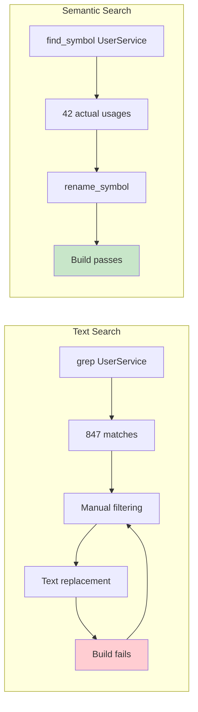

Semantic search is the difference between 3 hours and 5 minutes.

AI coding agents fail on large codebases not because AI isn't good enough—but because brute-force text search doesn't scale. Give your agent semantic tools and watch it actually work.

This post shows you how to set up semantic search MCP servers that make large codebase refactoring viable.

## The Problem: Brute Force Doesn't Scale

```
┌─────────────────────────────────────────────────────────────┐
│              BRUTE FORCE TEXT SEARCH                        │
├─────────────────────────────────────────────────────────────┤
│                                                             │
│   Task: Rename type "UserService" → "UserManager"           │
│                                                             │
│   Step 1: grep -r "UserService" .                           │
│           → 847 matches across 312 files                    │
│           → Includes comments, strings, similar names       │
│           → 15,000 tokens consumed                          │
│                                                             │
│   Step 2: Agent reads each file                             │
│           → Looking for actual type usage                   │
│           → More tokens consumed                            │
│                                                             │
│   Step 3: Agent makes changes                               │
│           → Text replacement                                │
│           → Misses generic constraints                      │
│           → Misses reflection usage                         │
│                                                             │
│   Step 4: Build fails                                       │
│           → Agent scans again                               │
│           → More tokens                                     │
│           → Loop continues...                               │
│                                                             │
│   Result: 3 hours, 28M tokens, $14, still broken            │
│                                                             │
└─────────────────────────────────────────────────────────────┘
```

## The Solution: Semantic Search

```
┌─────────────────────────────────────────────────────────────┐
│              SEMANTIC CODE SEARCH                           │
├─────────────────────────────────────────────────────────────┤
│                                                             │
│   Task: Rename type "UserService" → "UserManager"           │
│                                                             │
│   Step 1: find_symbol("UserService", type="class")          │
│           → Semantic understanding of code structure        │
│           → Returns: definition location, all usages        │
│           → 500 tokens consumed                             │
│                                                             │
│   Step 2: rename_symbol("UserService", "UserManager")       │
│           → Uses compiler's refactoring engine              │
│           → Handles generics, reflection, inheritance       │
│           → Updates all semantic references                 │
│                                                             │
│   Step 3: Done                                              │
│           → Build passes first try                          │
│           → 5 minutes total                                 │
│                                                             │
│   Result: 5 minutes, 1M tokens, $0.60, works                │
│                                                             │
└─────────────────────────────────────────────────────────────┘
```

## The Key Insight

Semantic search understands what you're looking for—not just the text pattern.



The difference:
- Text search: "Find this string anywhere"
- Semantic search: "Find this symbol in the AST"

## Setting Up Serena MCP

Serena provides semantic search for multiple languages:

### Installation

```bash
# Clone the repository
git clone https://github.com/oramasearch/serena.git
cd serena

# Install dependencies
npm install

# Build the project
npm run build
```

### Configuration

Add to your Claude Desktop config (`~/Library/Application Support/Claude/claude_desktop_config.json`):

```json
{
  "mcpServers": {
    "serena": {
      "command": "node",
      "args": ["/path/to/serena/dist/index.js"],
      "env": {
        "PROJECT_ROOT": "/path/to/your/codebase"
      }
    }
  }
}
```

For Claude Code, add to `~/.claude/mcp.json`:

```json
{
  "mcpServers": {
    "serena": {
      "command": "node",
      "args": ["/path/to/serena/dist/index.js"],
      "env": {
        "PROJECT_ROOT": "."
      }
    }
  }
}
```

### Available Tools

Once configured, your agent has access to:

| Tool | Description |
|------|-------------|
| `find_symbol` | Find symbol definition and all usages |
| `find_references` | Find all references to a symbol |
| `get_definition` | Get the definition of a symbol at a location |
| `semantic_search` | Search code semantically, not just text |
| `get_file_symbols` | List all symbols in a file |

## Setting Up Refactor MCP (for .NET)

For C#/.NET codebases, add Roslyn-powered refactoring:

### Installation

```bash
# Clone the repository
git clone https://github.com/JetBrains/refactor-mcp.git
cd refactor-mcp

# Build
dotnet build

# Note the output path
```

### Configuration

Add to your MCP config:

```json
{
  "mcpServers": {
    "refactor": {
      "command": "dotnet",
      "args": ["run", "--project", "/path/to/refactor-mcp"],
      "env": {
        "SOLUTION_PATH": "/path/to/your/solution.sln"
      }
    }
  }
}
```

### Available Refactoring Operations

| Tool | Description |
|------|-------------|
| `rename_symbol` | Rename with full semantic awareness |
| `extract_method` | Extract code into a new method |
| `inline_method` | Inline a method at call sites |
| `extract_interface` | Create interface from class |
| `move_type` | Move type to another file/namespace |

## The Workflow Comparison

### Without Semantic Tools (3 hours)

```
User: "Rename UserService to UserManager across the codebase"

Agent:
1. grep -r "UserService" . → 847 results
2. Read 312 files → 28M tokens consumed
3. Text-replace in each file
4. Build fails (missed generic constraints)
5. grep again for the error
6. Fix, rebuild
7. Build fails (missed reflection usage)
8. Loop continues...

Result: 3 hours, multiple human interventions, $14
```

### With Semantic Tools (5 minutes)

```
User: "Rename UserService to UserManager across the codebase"

Agent:
1. find_symbol("UserService") → 42 actual usages
2. rename_symbol("UserService", "UserManager")
3. Build passes

Result: 5 minutes, autonomous, $0.60
```

## POC: Using Semantic Search

Here's how your prompts change with semantic tools:

### Before (Text-Based)

```markdown
# Refactoring Task

Find all occurrences of "UserService" using grep.
Read each file to understand context.
Replace the text carefully, checking for:
- Class definitions
- Import statements
- Type references
- Generic constraints
- Reflection strings

Run the build after each batch of changes.
If it fails, analyze the error and fix.
```

### After (Semantic)

```markdown
# Refactoring Task

Use find_symbol to locate the UserService type.
Use rename_symbol to rename it to UserManager.
The semantic refactoring handles all edge cases.
Verify with a single build at the end.
```

The prompt is simpler because the tool is smarter.

## Data Flow: Semantic Refactoring

```
┌─────────────────────────────────────────────────────────────┐
│                SEMANTIC REFACTORING FLOW                    │
├─────────────────────────────────────────────────────────────┤
│                                                             │
│   User Request                                              │
│        │                                                    │
│        ▼                                                    │
│   ┌─────────────────┐                                       │
│   │ Agent decides   │                                       │
│   │ refactor needed │                                       │
│   └────────┬────────┘                                       │
│            │                                                │
│            ▼                                                │
│   ┌─────────────────┐     ┌─────────────────┐              │
│   │ Serena MCP      │────▶│ AST Analysis    │              │
│   │ find_symbol()   │     │ 42 usages found │              │
│   └────────┬────────┘     └─────────────────┘              │
│            │                                                │
│            ▼                                                │
│   ┌─────────────────┐     ┌─────────────────┐              │
│   │ Refactor MCP    │────▶│ Compiler Engine │              │
│   │ rename_symbol() │     │ All refs updated│              │
│   └────────┬────────┘     └─────────────────┘              │
│            │                                                │
│            ▼                                                │
│   ┌─────────────────┐                                       │
│   │ Build passes    │                                       │
│   │ on first try    │                                       │
│   └─────────────────┘                                       │
│                                                             │
└─────────────────────────────────────────────────────────────┘
```

## Agent Opportunity: Language-Specific MCP Servers

Build or find semantic MCP servers for your stack:

### TypeScript/JavaScript

```bash
# typescript-language-server provides semantic operations
npm install -g typescript-language-server

# MCP wrapper available at:
# https://github.com/anthropics/mcp-typescript
```

### Python

```bash
# Pyright provides semantic analysis
pip install pyright

# MCP wrapper available at:
# https://github.com/anthropics/mcp-python
```

### Go

```bash
# gopls provides semantic operations
go install golang.org/x/tools/gopls@latest

# MCP wrapper pattern similar to others
```

## The Numbers

Real measurements from a 55,000 file codebase:

| Metric | Text Search | Semantic Search | Improvement |
|--------|-------------|-----------------|-------------|
| Time | 3 hours | 5 minutes | 36x |
| Tokens | 28M | 1M | 28x |
| Cost | $14 | $0.60 | 23x |
| Human intervention | Constant | None | ∞ |
| Build failures | 4 | 0 | - |

The cost of NOT having semantic tools scales with codebase size. A 10x larger codebase isn't 10x worse—it's 100x worse with text search.

## Implementation Checklist

**Week 1: Basic Setup**
- [ ] Install Serena MCP for your primary language
- [ ] Configure in Claude Code or Claude Desktop
- [ ] Test with `find_symbol` on a known type
- [ ] Verify results match manual inspection

**Week 2: Refactoring Operations**
- [ ] Add language-specific refactor MCP if available
- [ ] Test `rename_symbol` on non-critical code
- [ ] Measure token consumption before/after
- [ ] Document the improvement

**Week 3: Integration**
- [ ] Update your refactoring prompts to use semantic tools
- [ ] Create workflow templates that default to semantic ops
- [ ] Train team on new capabilities
- [ ] Monitor cost reduction

## When to Use What

```
┌─────────────────────────────────────────────────────────────┐
│                    TOOL SELECTION                           │
├─────────────────────────────────────────────────────────────┤
│                                                             │
│   Task                      Tool                            │
│   ────                      ────                            │
│   Find string in logs       grep (text is fine)             │
│   Find config value         grep (no semantics needed)      │
│   Search documentation      grep (plain text)               │
│                                                             │
│   Find type definition      semantic (AST required)         │
│   Find all usages           semantic (context matters)      │
│   Rename symbol             semantic (compiler needed)      │
│   Extract method            semantic (scope analysis)       │
│   Find implementations      semantic (inheritance tree)     │
│                                                             │
│   Rule: If it involves code structure, use semantic.        │
│         If it's plain text, grep is fine.                   │
│                                                             │
└─────────────────────────────────────────────────────────────┘
```

## The Key Takeaway

Large codebase productivity depends more on tool sophistication than raw AI model capabilities.

You can throw Opus at a 55,000 file codebase with text search and fail. Or you can use Haiku with semantic tools and succeed.

The build-fail-retry cycle is the productivity bottleneck. Semantic tools eliminate it almost completely.

Your 55,000-file legacy codebase is waiting. With the right tools, it takes 5 minutes, not 5 weeks.

---

**Key Takeaways:**
- Semantic search understands code structure, not just text
- Serena MCP provides cross-language semantic operations
- Refactor MCP provides language-specific compiler tools
- 28x token reduction with semantic vs text search
- Build-fail-retry loops eliminated
- Tool sophistication > model capability for large codebases
- One-shot autonomous execution becomes possible

**Try It Now:**
Install Serena MCP. Run `find_symbol` on a type in your codebase. Compare the results to `grep`.
