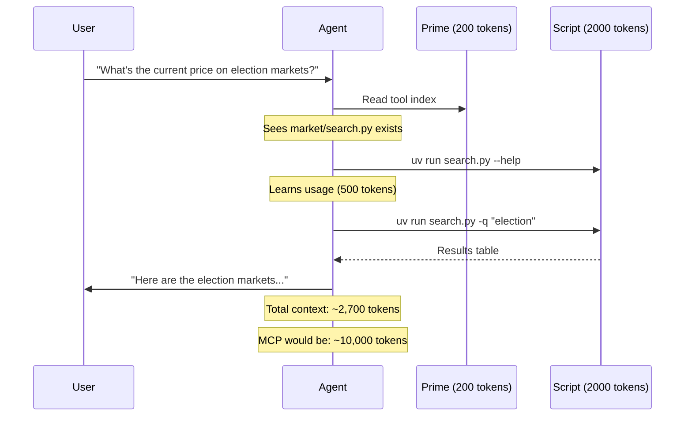

Progressive disclosure is the pattern that saves 90% of your context consumption.

Instead of loading all tools upfront, you load them only when needed. Instead of giving your agent every possible capability at once, you give it a map of where to find things—and let it load what it actually uses.

This post shows you how to implement progressive disclosure with working code you can use today.

## The Problem: Upfront Loading

```
┌─────────────────────────────────────────────────────────────┐
│              MCP SERVER LOADING (TRADITIONAL)               │
├─────────────────────────────────────────────────────────────┤
│                                                             │
│   Agent starts                                              │
│        │                                                    │
│        ▼                                                    │
│   ┌─────────────────┐                                       │
│   │ Load ALL tools  │ ←── 10,000 tokens per MCP server     │
│   │ from ALL MCPs   │                                       │
│   └────────┬────────┘                                       │
│            │                                                │
│            ▼                                                │
│   ┌─────────────────┐                                       │
│   │ 40,000 tokens   │ ←── 20% of context GONE              │
│   │ consumed        │     before any work starts           │
│   └────────┬────────┘                                       │
│            │                                                │
│            ▼                                                │
│   Agent begins actual work with 80% remaining context       │
│                                                             │
└─────────────────────────────────────────────────────────────┘
```

Four MCP servers at 10,000 tokens each = 40,000 tokens consumed before you type a single character.

## Progressive Disclosure: The Solution

```
┌─────────────────────────────────────────────────────────────┐
│              PROGRESSIVE DISCLOSURE PATTERN                 │
├─────────────────────────────────────────────────────────────┤
│                                                             │
│   Agent starts                                              │
│        │                                                    │
│        ▼                                                    │
│   ┌─────────────────┐                                       │
│   │ Load PRIME only │ ←── ~500 tokens (tool map)           │
│   │ (index of tools)│                                       │
│   └────────┬────────┘                                       │
│            │                                                │
│            ▼                                                │
│   Agent needs market data?                                  │
│        │                                                    │
│        ▼                                                    │
│   ┌─────────────────┐                                       │
│   │ Load ONLY       │ ←── 2,000 tokens (one script)        │
│   │ market_search.py│                                       │
│   └────────┬────────┘                                       │
│            │                                                │
│            ▼                                                │
│   Agent continues with 98% context remaining                │
│                                                             │
└─────────────────────────────────────────────────────────────┘
```

Result: 2,000 tokens instead of 40,000. **95% reduction.**

## POC: Implementing Progressive Disclosure

Here's a complete implementation using UV single-file scripts:

### Step 1: Create the Tool Index (Prime Prompt)

```markdown
# Available Tools

You have access to the following tool scripts. **Do not read script contents unless --help doesn't provide enough information.**

## Market Tools
Located in: `~/tools/market/`
- `search.py` - Search prediction markets by keyword
- `get_market.py` - Get details for specific market ID
- `get_orderbook.py` - Get current orderbook for market

## Data Tools
Located in: `~/tools/data/`
- `fetch_csv.py` - Download CSV from URL
- `analyze_csv.py` - Basic statistical analysis
- `transform_csv.py` - Transform/filter CSV data

## When you need a tool:
1. Run `uv run ~/tools/{category}/{script}.py --help`
2. Read the help output to understand usage
3. Run the tool with appropriate arguments
4. Only read script source if help is insufficient
```

This index costs ~200 tokens. The agent knows WHERE tools are without loading them.

### Step 2: Create UV Single-File Scripts

Each script is self-contained with embedded dependencies:

**`~/tools/market/search.py`**
```python
#!/usr/bin/env -S uv run
# /// script
# dependencies = [
#   "requests>=2.31.0",
#   "rich>=13.0.0",
# ]
# ///
"""
Search prediction markets by keyword.

Usage:
    uv run search.py --query "election" [--limit 10]

Arguments:
    --query, -q    Search term (required)
    --limit, -l    Max results (default: 10)
    --format, -f   Output format: json|table (default: table)
"""

import argparse
import json
import requests
from rich.console import Console
from rich.table import Table

KALSHI_API = "https://trading-api.kalshi.com/trade-api/v2"

def search_markets(query: str, limit: int = 10) -> list:
    """Search Kalshi markets by keyword."""
    response = requests.get(
        f"{KALSHI_API}/markets",
        params={"status": "open", "limit": limit},
        headers={"Accept": "application/json"}
    )
    response.raise_for_status()

    markets = response.json().get("markets", [])
    # Filter by query in title
    return [m for m in markets if query.lower() in m.get("title", "").lower()][:limit]

def main():
    parser = argparse.ArgumentParser(description="Search prediction markets")
    parser.add_argument("-q", "--query", required=True, help="Search term")
    parser.add_argument("-l", "--limit", type=int, default=10, help="Max results")
    parser.add_argument("-f", "--format", choices=["json", "table"], default="table")

    args = parser.parse_args()

    markets = search_markets(args.query, args.limit)

    if args.format == "json":
        print(json.dumps(markets, indent=2))
    else:
        console = Console()
        table = Table(title=f"Markets matching '{args.query}'")
        table.add_column("ID", style="cyan")
        table.add_column("Title", style="green")
        table.add_column("Volume", justify="right")

        for m in markets:
            table.add_row(
                m.get("ticker", ""),
                m.get("title", "")[:50],
                str(m.get("volume", 0))
            )

        console.print(table)

if __name__ == "__main__":
    main()
```

**`~/tools/market/get_market.py`**
```python
#!/usr/bin/env -S uv run
# /// script
# dependencies = [
#   "requests>=2.31.0",
#   "rich>=13.0.0",
# ]
# ///
"""
Get detailed information about a specific market.

Usage:
    uv run get_market.py --id "MARKET_ID"

Arguments:
    --id, -i       Market ticker/ID (required)
    --format, -f   Output format: json|summary (default: summary)
"""

import argparse
import json
import requests
from rich.console import Console
from rich.panel import Panel

KALSHI_API = "https://trading-api.kalshi.com/trade-api/v2"

def get_market(market_id: str) -> dict:
    """Get market details by ID."""
    response = requests.get(
        f"{KALSHI_API}/markets/{market_id}",
        headers={"Accept": "application/json"}
    )
    response.raise_for_status()
    return response.json().get("market", {})

def main():
    parser = argparse.ArgumentParser(description="Get market details")
    parser.add_argument("-i", "--id", required=True, help="Market ID")
    parser.add_argument("-f", "--format", choices=["json", "summary"], default="summary")

    args = parser.parse_args()

    market = get_market(args.id)

    if args.format == "json":
        print(json.dumps(market, indent=2))
    else:
        console = Console()
        summary = f"""
[bold]Title:[/bold] {market.get('title', 'N/A')}
[bold]Status:[/bold] {market.get('status', 'N/A')}
[bold]Yes Price:[/bold] {market.get('yes_ask', 'N/A')}¢
[bold]No Price:[/bold] {market.get('no_ask', 'N/A')}¢
[bold]Volume:[/bold] ${market.get('volume', 0):,}
[bold]Close Date:[/bold] {market.get('close_time', 'N/A')}
        """
        console.print(Panel(summary, title=market.get('ticker', 'Market')))

if __name__ == "__main__":
    main()
```

### Step 3: The Flow in Practice



## The Numbers

| Approach | Initial Load | Per-Tool Cost | 4 Tools Used |
|----------|-------------|---------------|--------------|
| MCP Server | 10,000 tokens | 0 (pre-loaded) | 10,000 |
| Progressive | 200 tokens | 500-2000 | 2,200-8,200 |

Progressive disclosure wins when you use fewer than all available tools—which is almost always.

## Agent Opportunity: Build a Tool Directory

Create a standardized tool structure your agents can navigate:

```
~/tools/
├── README.md              # The prime prompt (tool index)
├── market/
│   ├── search.py
│   ├── get_market.py
│   └── get_orderbook.py
├── data/
│   ├── fetch_csv.py
│   ├── analyze_csv.py
│   └── transform_csv.py
├── git/
│   ├── status.py
│   ├── diff.py
│   └── commit.py
└── api/
    ├── github_issues.py
    ├── slack_post.py
    └── notion_update.py
```

Each script follows the same pattern:
1. UV shebang with dependencies
2. Docstring with usage examples
3. Argparse with `--help`
4. Clean output (JSON option for machine parsing)

## Implementation Template

Use this template for new tools:

```python
#!/usr/bin/env -S uv run
# /// script
# dependencies = [
#   "requests>=2.31.0",  # Add your deps here
# ]
# ///
"""
One-line description of what this tool does.

Usage:
    uv run tool.py --required-arg "value" [--optional-arg default]

Arguments:
    --required-arg, -r    Description (required)
    --optional-arg, -o    Description (default: value)
    --format, -f          Output format: json|human (default: human)

Examples:
    uv run tool.py -r "example"
    uv run tool.py -r "example" -f json | jq '.field'
"""

import argparse
import json

def main():
    parser = argparse.ArgumentParser(
        description="Tool description",
        formatter_class=argparse.RawDescriptionHelpFormatter,
        epilog=__doc__
    )
    parser.add_argument("-r", "--required-arg", required=True)
    parser.add_argument("-o", "--optional-arg", default="default")
    parser.add_argument("-f", "--format", choices=["json", "human"], default="human")

    args = parser.parse_args()

    # Your logic here
    result = {"status": "success", "data": args.required_arg}

    if args.format == "json":
        print(json.dumps(result, indent=2))
    else:
        print(f"Result: {result['data']}")

if __name__ == "__main__":
    main()
```

## When to Use What

```
┌─────────────────────────────────────────────────────────────┐
│                    DECISION FRAMEWORK                       │
├─────────────────────────────────────────────────────────────┤
│                                                             │
│   Use MCP (80% of cases):                                   │
│   • External APIs you don't control (GitHub, Stripe)        │
│   • Tools maintained by vendors                             │
│   • Quick prototyping                                       │
│   • When context isn't scarce                               │
│                                                             │
│   Use CLI/Progressive (15% of cases):                       │
│   • Custom internal tools                                   │
│   • Tools you'll modify                                     │
│   • Team-wide utilities                                     │
│   • When you need control                                   │
│                                                             │
│   Use Scripts (5% of cases):                                │
│   • Multi-tool stacking scenarios                           │
│   • Large codebase analysis                                 │
│   • When every token matters                                │
│   • Specialized single-purpose agents                       │
│                                                             │
└─────────────────────────────────────────────────────────────┘
```

## Measuring Your Context Bleed

Add this to your workflow to track consumption:

```bash
# Before loading MCPs
claude --print-context-stats

# After loading MCPs
claude --print-context-stats

# The difference = your tool overhead
```

In Claude Code, use `/context` to check current consumption.

If tools consume more than 15% of your context, you have an architecture problem.

## The Key Insight

Progressive disclosure works because agents don't need all tools all the time.

Traditional MCP loading assumes worst case: "load everything because we might need it." Progressive disclosure assumes best case: "load nothing until we need it."

Most tasks use 2-3 tools out of 20 available. Pay for what you use.

---

**Key Takeaways:**
- Progressive disclosure reduces context 90%+ vs MCP servers
- Tool index (prime prompt) costs ~200 tokens
- UV single-file scripts are self-contained and portable
- Each script should have --help and JSON output option
- Build a tool directory structure agents can navigate
- 15% context for tools is a reasonable ceiling
- Measure before and after to validate savings

**Try It Now:**
Create `~/tools/README.md` with an index of 3 scripts. Point your agent at it instead of loading an MCP server.
