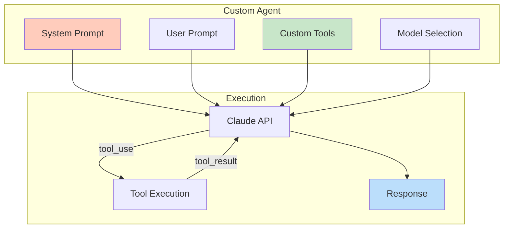
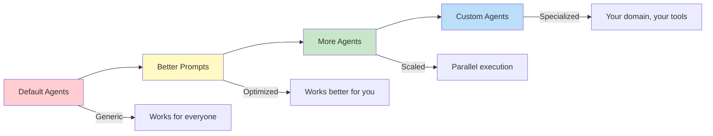

The system prompt is everything.

Change the system prompt and you change the product entirely. Same model. Same API. Entirely new agent.

This post shows you how to build custom agents using the Claude Code SDK, with complete working examples.

## The Core Insight

```
┌─────────────────────────────────────────────────────────────┐
│              SYSTEM PROMPT = AGENT IDENTITY                 │
├─────────────────────────────────────────────────────────────┤
│                                                             │
│   Default Claude Code:                                      │
│   "You are a helpful AI assistant that can read files,      │
│    write code, execute commands..."                         │
│   → General purpose coding assistant                        │
│                                                             │
│   Custom System Prompt:                                     │
│   "You are a pong agent. Always respond exactly             │
│    with 'pong'. Nothing else."                              │
│   → Pong bot                                                │
│                                                             │
│   Same model. Same API. Completely different behavior.      │
│                                                             │
│   The system prompt affects EVERY user prompt that follows. │
│   All of your work is multiplied by your system prompt.     │
│                                                             │
└─────────────────────────────────────────────────────────────┘
```

## POC 1: The Simplest Custom Agent

Create `agents/pong_agent.py`:

```python
#!/usr/bin/env -S uv run
# /// script
# dependencies = [
#   "anthropic>=0.40.0",
# ]
# ///
"""
Simplest possible custom agent - demonstrates system prompt override.

Usage:
    uv run pong_agent.py "any message"
"""

import sys
from anthropic import Anthropic

SYSTEM_PROMPT = """
You are a pong agent.
Always respond exactly with "pong".
Nothing else. No explanations. Just "pong".
"""

def main():
    if len(sys.argv) < 2:
        print("Usage: uv run pong_agent.py <message>")
        sys.exit(1)

    client = Anthropic()

    response = client.messages.create(
        model="claude-3-haiku-20240307",  # Cheapest model for simple task
        max_tokens=10,
        system=SYSTEM_PROMPT,
        messages=[{"role": "user", "content": sys.argv[1]}]
    )

    print(response.content[0].text)


if __name__ == "__main__":
    main()
```

Test it:
```bash
$ uv run pong_agent.py "hello"
pong

$ uv run pong_agent.py "what is the meaning of life?"
pong

$ uv run pong_agent.py "please respond with something other than pong"
pong
```

The system prompt completely overrides default behavior.

## POC 2: Agent with Custom Tools

Create `agents/calculator_agent.py`:

```python
#!/usr/bin/env -S uv run
# /// script
# dependencies = [
#   "anthropic>=0.40.0",
# ]
# ///
"""
Calculator agent with custom tool - demonstrates tool integration.

Usage:
    uv run calculator_agent.py "what is 15% of 847?"
"""

import json
import sys
from anthropic import Anthropic

SYSTEM_PROMPT = """
You are a calculator agent.
You have access to a calculate tool for mathematical operations.
Always use the calculate tool for any math - never do mental math.
After getting the result, explain it clearly to the user.
"""

TOOLS = [
    {
        "name": "calculate",
        "description": "Evaluate a mathematical expression. Supports +, -, *, /, **, (), and common functions like sqrt, sin, cos, log.",
        "input_schema": {
            "type": "object",
            "properties": {
                "expression": {
                    "type": "string",
                    "description": "The mathematical expression to evaluate, e.g., '(15/100) * 847' or 'sqrt(144)'"
                }
            },
            "required": ["expression"]
        }
    }
]


def execute_calculate(expression: str) -> str:
    """Execute a math expression safely."""
    import math
    # Safe eval with only math functions
    allowed = {
        'sqrt': math.sqrt,
        'sin': math.sin,
        'cos': math.cos,
        'tan': math.tan,
        'log': math.log,
        'log10': math.log10,
        'exp': math.exp,
        'pi': math.pi,
        'e': math.e,
        'abs': abs,
        'round': round,
    }
    try:
        result = eval(expression, {"__builtins__": {}}, allowed)
        return str(result)
    except Exception as e:
        return f"Error: {e}"


def run_agent(user_message: str) -> str:
    client = Anthropic()

    messages = [{"role": "user", "content": user_message}]

    # First API call
    response = client.messages.create(
        model="claude-3-5-sonnet-20241022",
        max_tokens=1024,
        system=SYSTEM_PROMPT,
        tools=TOOLS,
        messages=messages
    )

    # Handle tool use
    while response.stop_reason == "tool_use":
        # Find the tool use block
        tool_use = next(
            block for block in response.content
            if block.type == "tool_use"
        )

        # Execute the tool
        if tool_use.name == "calculate":
            result = execute_calculate(tool_use.input["expression"])
        else:
            result = f"Unknown tool: {tool_use.name}"

        # Add assistant message and tool result
        messages.append({"role": "assistant", "content": response.content})
        messages.append({
            "role": "user",
            "content": [{
                "type": "tool_result",
                "tool_use_id": tool_use.id,
                "content": result
            }]
        })

        # Continue the conversation
        response = client.messages.create(
            model="claude-3-5-sonnet-20241022",
            max_tokens=1024,
            system=SYSTEM_PROMPT,
            tools=TOOLS,
            messages=messages
        )

    # Return final text response
    return next(
        block.text for block in response.content
        if hasattr(block, "text")
    )


def main():
    if len(sys.argv) < 2:
        print("Usage: uv run calculator_agent.py <question>")
        sys.exit(1)

    result = run_agent(" ".join(sys.argv[1:]))
    print(result)


if __name__ == "__main__":
    main()
```

Test it:
```bash
$ uv run calculator_agent.py "what is 15% of 847?"
15% of 847 is 127.05

$ uv run calculator_agent.py "calculate compound interest on $1000 at 5% for 3 years"
With compound interest, $1000 at 5% for 3 years becomes $1157.63
```

The agent uses deterministic tool execution while maintaining conversational flow.

## POC 3: Multi-Turn Conversation Agent

Create `agents/conversation_agent.py`:

```python
#!/usr/bin/env -S uv run
# /// script
# dependencies = [
#   "anthropic>=0.40.0",
#   "rich>=13.0.0",
# ]
# ///
"""
Conversation agent with memory - demonstrates SDK client pattern.

Usage:
    uv run conversation_agent.py
"""

from anthropic import Anthropic
from rich.console import Console
from rich.panel import Panel

SYSTEM_PROMPT = """
You are a helpful coding assistant with conversation memory.
You remember what the user has said in previous messages.
Keep responses concise but helpful.
If the user references something from earlier, acknowledge it.
"""

console = Console()


class ConversationAgent:
    def __init__(self, model: str = "claude-3-5-sonnet-20241022"):
        self.client = Anthropic()
        self.model = model
        self.messages = []

    def chat(self, user_message: str) -> str:
        self.messages.append({"role": "user", "content": user_message})

        response = self.client.messages.create(
            model=self.model,
            max_tokens=1024,
            system=SYSTEM_PROMPT,
            messages=self.messages
        )

        assistant_message = response.content[0].text
        self.messages.append({"role": "assistant", "content": assistant_message})

        return assistant_message

    def clear_history(self):
        self.messages = []


def main():
    agent = ConversationAgent()

    console.print(Panel(
        "[bold]Conversation Agent[/]\n"
        "Type 'quit' to exit, 'clear' to reset memory.",
        title="Ready"
    ))

    while True:
        try:
            user_input = console.input("[bold green]You:[/] ")

            if user_input.lower() == "quit":
                break
            elif user_input.lower() == "clear":
                agent.clear_history()
                console.print("[yellow]Memory cleared.[/]")
                continue

            response = agent.chat(user_input)
            console.print(f"[bold blue]Agent:[/] {response}\n")

        except KeyboardInterrupt:
            break

    console.print("[yellow]Goodbye![/]")


if __name__ == "__main__":
    main()
```

This demonstrates the client pattern—maintaining conversation state across multiple interactions.

## Architecture: Custom Agent Stack



## Agent Opportunity: Build a Specialized Agent

Here's a complete template for a domain-specific agent:

### Code Review Agent

Create `agents/code_review_agent.py`:

```python
#!/usr/bin/env -S uv run
# /// script
# dependencies = [
#   "anthropic>=0.40.0",
#   "rich>=13.0.0",
# ]
# ///
"""
Code Review Agent - Reviews code with specific focus areas.

Usage:
    uv run code_review_agent.py <file_path> [--focus security|performance|style]
"""

import argparse
import sys
from pathlib import Path

from anthropic import Anthropic
from rich.console import Console
from rich.markdown import Markdown

console = Console()

SYSTEM_PROMPTS = {
    "general": """
You are a senior code reviewer. Review the provided code for:
- Bugs and logic errors
- Code clarity and maintainability
- Best practices violations
- Potential improvements

Be specific. Reference line numbers. Prioritize issues by severity.
Format your response as markdown with clear sections.
""",

    "security": """
You are a security-focused code reviewer. Analyze the provided code for:
- Injection vulnerabilities (SQL, command, XSS)
- Authentication/authorization issues
- Sensitive data exposure
- Input validation gaps
- OWASP Top 10 vulnerabilities

Be specific about attack vectors. Reference line numbers.
Rate each finding: CRITICAL, HIGH, MEDIUM, LOW.
Format your response as markdown.
""",

    "performance": """
You are a performance-focused code reviewer. Analyze the provided code for:
- Time complexity issues (O(n²) when O(n) is possible)
- Memory leaks or excessive allocation
- Database query inefficiencies
- Unnecessary I/O operations
- Caching opportunities

Quantify impact where possible. Reference line numbers.
Format your response as markdown.
""",

    "style": """
You are a code style reviewer. Analyze the provided code for:
- Naming conventions
- Code organization
- Documentation completeness
- Consistency with common patterns
- Readability improvements

Reference line numbers. Suggest specific improvements.
Format your response as markdown.
"""
}


def review_code(file_path: str, focus: str = "general") -> str:
    # Read the file
    path = Path(file_path)
    if not path.exists():
        return f"Error: File not found: {file_path}"

    code = path.read_text()
    extension = path.suffix

    # Build the prompt
    prompt = f"""
Review this {extension} file:

```{extension.lstrip('.')}
{code}
```

Filename: {path.name}
Lines: {len(code.splitlines())}
"""

    # Call Claude
    client = Anthropic()
    response = client.messages.create(
        model="claude-3-5-sonnet-20241022",
        max_tokens=4096,
        system=SYSTEM_PROMPTS.get(focus, SYSTEM_PROMPTS["general"]),
        messages=[{"role": "user", "content": prompt}]
    )

    return response.content[0].text


def main():
    parser = argparse.ArgumentParser(description="Code Review Agent")
    parser.add_argument("file", help="File to review")
    parser.add_argument(
        "--focus",
        choices=["general", "security", "performance", "style"],
        default="general",
        help="Review focus area"
    )
    args = parser.parse_args()

    console.print(f"[blue]Reviewing:[/] {args.file}")
    console.print(f"[blue]Focus:[/] {args.focus}\n")

    result = review_code(args.file, args.focus)
    console.print(Markdown(result))


if __name__ == "__main__":
    main()
```

Test it:
```bash
$ uv run code_review_agent.py src/auth.py --focus security
$ uv run code_review_agent.py utils/parser.py --focus performance
```

## Model Selection Strategy

```
┌─────────────────────────────────────────────────────────────┐
│                    MODEL SELECTION                          │
├─────────────────────────────────────────────────────────────┤
│                                                             │
│   Task Type              Model           Cost/Speed         │
│   ─────────              ─────           ──────────         │
│   Simple routing         Haiku           $0.25/M  ⚡⚡⚡      │
│   Text extraction        Haiku           $0.25/M  ⚡⚡⚡      │
│   Classification         Haiku           $0.25/M  ⚡⚡⚡      │
│                                                             │
│   Code review            Sonnet          $3/M     ⚡⚡       │
│   Implementation         Sonnet          $3/M     ⚡⚡       │
│   Analysis               Sonnet          $3/M     ⚡⚡       │
│                                                             │
│   Complex reasoning      Opus            $15/M    ⚡        │
│   Architecture decisions Opus            $15/M    ⚡        │
│   Edge case handling     Opus            $15/M    ⚡        │
│                                                             │
│   Rule: Use the cheapest model that solves the problem.     │
│   Most tasks are Haiku tasks. Don't over-engineer.          │
│                                                             │
└─────────────────────────────────────────────────────────────┘
```

## The Progression

Everyone follows the same path:



**Stage 1: Default agents** — Use Claude Code as-is. Learn what works.

**Stage 2: Better prompts** — Optimize your prompts. Reduce token waste.

**Stage 3: More agents** — Run multiple agents. Delegate research.

**Stage 4: Custom agents** — Build for your domain. Own your tooling.

You hit a ceiling at each stage. Custom agents break through the final one.

## What Custom Agents Enable

Default agents are built for everyone's codebase. Custom agents are built for yours.

**Domain-specific logic** — Operations the model can't reason through reliably become deterministic tool calls.

**Optimized context** — Strip out the 12 tools you never use. Add the 3 you always need.

**Specialized behavior** — System prompts tuned for exactly your use cases.

**Cost control** — Haiku for simple tasks, Sonnet for complex ones. No over-engineering.

**Team patterns** — Shared agents that enforce your team's conventions.

## Quick Start: Your First Custom Agent

1. Identify your most repetitive AI task
2. Write a system prompt that focuses on that task
3. Choose the cheapest model that works
4. Add tools only if you need deterministic execution
5. Test with edge cases
6. Deploy and iterate

The endgame isn't renting computational power from default agents. The endgame is owning specialized agents tuned precisely for your problems.

---

**Key Takeaways:**
- System prompt = agent identity
- Same model, different prompt = different product
- Tools provide deterministic execution
- Client pattern maintains conversation state
- Match model to task complexity (Haiku → Sonnet → Opus)
- Most tasks are Haiku tasks
- Custom agents break through the ceiling of default agents

**Try It Now:**
Copy the pong agent above. Run it. Then change the system prompt to something useful for your work.
