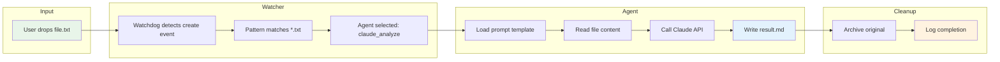

# Beyond the Chat Box

Directory watchers turn your file system into an AI interface.

Drag a file into a folder. An agent processes it automatically. You get results. No chat. No prompting. No human-in-the-loop.

This post shows you how to build a complete drop zone system with working Python code.

## The Architecture

```
┌─────────────────────────────────────────────────────────────┐
│                    DROP ZONE ARCHITECTURE                   │
├─────────────────────────────────────────────────────────────┤
│                                                             │
│   ~/drops/                                                  │
│   ├── transcribe/     ──────▶  Whisper → text             │
│   ├── analyze/        ──────▶  Claude → summary           │
│   ├── images/         ──────▶  Replicate → generations    │
│   └── data/           ──────▶  Claude → analysis          │
│                                                             │
│   ┌─────────────────────────────────────────────────────┐   │
│   │              DIRECTORY WATCHER                       │   │
│   │                                                      │   │
│   │   ┌──────────┐    ┌──────────┐    ┌──────────┐     │   │
│   │   │ watchdog │───▶│ Pattern  │───▶│  Agent   │     │   │
│   │   │  events  │    │  Match   │    │ Execute  │     │   │
│   │   └──────────┘    └──────────┘    └──────────┘     │   │
│   │                                                      │   │
│   └─────────────────────────────────────────────────────┘   │
│                           │                                 │
│                           ▼                                 │
│   ┌─────────────────────────────────────────────────────┐   │
│   │                    OUTPUTS                           │   │
│   │   ~/output/                                          │   │
│   │   └── {zone}/{timestamp}-{filename}.{result}        │   │
│   │                                                      │   │
│   │   ~/archive/                                         │   │
│   │   └── {zone}/{timestamp}-{filename}.{original}      │   │
│   └─────────────────────────────────────────────────────┘   │
│                                                             │
└─────────────────────────────────────────────────────────────┘
```

## POC: Complete Drop Zone System

### Step 1: Configuration File

Create `drops.yaml`:

```yaml
# Drop Zone Configuration
# Each zone watches a directory and triggers an agent on file events

output_dir: ~/output
archive_dir: ~/archive
log_dir: ~/logs

zones:
  transcribe:
    directory: ~/drops/transcribe
    patterns: ["*.mp3", "*.wav", "*.m4a", "*.webm"]
    agent: whisper_transcribe
    events: [created]

  analyze:
    directory: ~/drops/analyze
    patterns: ["*.txt", "*.md", "*.pdf"]
    agent: claude_analyze
    events: [created]

  images:
    directory: ~/drops/images
    patterns: ["*.txt"]  # Text file contains image prompts
    agent: replicate_generate
    events: [created]

  data:
    directory: ~/drops/data
    patterns: ["*.csv", "*.json"]
    agent: claude_data_analysis
    events: [created]

agents:
  whisper_transcribe:
    type: bash
    command: |
      whisper "{file}" --output_dir "{output_dir}" --output_format txt

  claude_analyze:
    type: claude
    prompt_file: prompts/analyze.md
    model: claude-3-5-sonnet-20241022

  replicate_generate:
    type: python
    script: agents/image_gen.py

  claude_data_analysis:
    type: claude
    prompt_file: prompts/data_analysis.md
    model: claude-3-5-sonnet-20241022
```

### Step 2: The Core Watcher

Create `drop_watcher.py`:

```python
#!/usr/bin/env -S uv run
# /// script
# dependencies = [
#   "watchdog>=4.0.0",
#   "pyyaml>=6.0",
#   "rich>=13.0.0",
#   "anthropic>=0.40.0",
# ]
# ///
"""
Drop Zone Watcher - File-based AI automation

Usage:
    uv run drop_watcher.py [--config drops.yaml]

Watches configured directories and triggers agents on file events.
"""

import argparse
import fnmatch
import os
import shutil
import subprocess
import time
from datetime import datetime
from pathlib import Path

import yaml
from anthropic import Anthropic
from rich.console import Console
from rich.panel import Panel
from watchdog.events import FileSystemEventHandler
from watchdog.observers import Observer

console = Console()

class DropZoneHandler(FileSystemEventHandler):
    def __init__(self, zone_name: str, zone_config: dict, global_config: dict):
        self.zone_name = zone_name
        self.zone_config = zone_config
        self.global_config = global_config
        self.patterns = zone_config.get("patterns", ["*"])
        self.agent_name = zone_config.get("agent")
        self.agent_config = global_config["agents"].get(self.agent_name, {})

    def on_created(self, event):
        if event.is_directory:
            return
        if "created" not in self.zone_config.get("events", ["created"]):
            return
        self._process_file(event.src_path)

    def on_modified(self, event):
        if event.is_directory:
            return
        if "modified" not in self.zone_config.get("events", []):
            return
        self._process_file(event.src_path)

    def _matches_pattern(self, filepath: str) -> bool:
        filename = os.path.basename(filepath)
        return any(fnmatch.fnmatch(filename, p) for p in self.patterns)

    def _process_file(self, filepath: str):
        if not self._matches_pattern(filepath):
            return

        # Wait for file to be fully written
        time.sleep(0.5)

        console.print(Panel(
            f"[bold green]Processing:[/] {filepath}\n"
            f"[bold blue]Zone:[/] {self.zone_name}\n"
            f"[bold yellow]Agent:[/] {self.agent_name}",
            title="Drop Detected"
        ))

        try:
            output_path = self._run_agent(filepath)
            self._archive_file(filepath)
            console.print(f"[green]✓[/] Output: {output_path}")
        except Exception as e:
            console.print(f"[red]✗[/] Error: {e}")

    def _run_agent(self, filepath: str) -> str:
        agent_type = self.agent_config.get("type", "bash")
        output_dir = self._get_output_dir()

        if agent_type == "bash":
            return self._run_bash_agent(filepath, output_dir)
        elif agent_type == "claude":
            return self._run_claude_agent(filepath, output_dir)
        elif agent_type == "python":
            return self._run_python_agent(filepath, output_dir)
        else:
            raise ValueError(f"Unknown agent type: {agent_type}")

    def _run_bash_agent(self, filepath: str, output_dir: str) -> str:
        command = self.agent_config["command"].format(
            file=filepath,
            output_dir=output_dir
        )
        subprocess.run(command, shell=True, check=True)
        return output_dir

    def _run_claude_agent(self, filepath: str, output_dir: str) -> str:
        prompt_file = self.agent_config.get("prompt_file")
        model = self.agent_config.get("model", "claude-3-5-sonnet-20241022")

        # Load prompt template
        with open(prompt_file) as f:
            prompt_template = f.read()

        # Read input file
        with open(filepath) as f:
            content = f.read()

        # Substitute variables
        prompt = prompt_template.replace("{content}", content)
        prompt = prompt.replace("{filename}", os.path.basename(filepath))

        # Call Claude
        client = Anthropic()
        response = client.messages.create(
            model=model,
            max_tokens=4096,
            messages=[{"role": "user", "content": prompt}]
        )

        result = response.content[0].text

        # Write output
        timestamp = datetime.now().strftime("%Y%m%d-%H%M%S")
        output_filename = f"{timestamp}-{Path(filepath).stem}.md"
        output_path = os.path.join(output_dir, output_filename)

        os.makedirs(output_dir, exist_ok=True)
        with open(output_path, "w") as f:
            f.write(result)

        return output_path

    def _run_python_agent(self, filepath: str, output_dir: str) -> str:
        script = self.agent_config["script"]
        result = subprocess.run(
            ["uv", "run", script, filepath, output_dir],
            capture_output=True,
            text=True,
            check=True
        )
        return result.stdout.strip()

    def _get_output_dir(self) -> str:
        base = os.path.expanduser(self.global_config.get("output_dir", "~/output"))
        return os.path.join(base, self.zone_name)

    def _archive_file(self, filepath: str):
        archive_base = os.path.expanduser(
            self.global_config.get("archive_dir", "~/archive")
        )
        archive_dir = os.path.join(archive_base, self.zone_name)
        os.makedirs(archive_dir, exist_ok=True)

        timestamp = datetime.now().strftime("%Y%m%d-%H%M%S")
        filename = os.path.basename(filepath)
        archive_path = os.path.join(archive_dir, f"{timestamp}-{filename}")

        shutil.move(filepath, archive_path)


def load_config(config_path: str) -> dict:
    with open(config_path) as f:
        return yaml.safe_load(f)


def setup_watchers(config: dict) -> Observer:
    observer = Observer()

    for zone_name, zone_config in config.get("zones", {}).items():
        directory = os.path.expanduser(zone_config["directory"])
        os.makedirs(directory, exist_ok=True)

        handler = DropZoneHandler(zone_name, zone_config, config)
        observer.schedule(handler, directory, recursive=False)

        console.print(f"[blue]Watching:[/] {directory} → {zone_config['agent']}")

    return observer


def main():
    parser = argparse.ArgumentParser(description="Drop Zone Watcher")
    parser.add_argument("--config", default="drops.yaml", help="Config file path")
    args = parser.parse_args()

    config = load_config(args.config)

    console.print(Panel(
        "[bold]Drop Zone Watcher[/]\n"
        "Drag files into watched directories to trigger AI agents.",
        title="Starting"
    ))

    observer = setup_watchers(config)
    observer.start()

    try:
        while True:
            time.sleep(1)
    except KeyboardInterrupt:
        observer.stop()
        console.print("[yellow]Shutting down...[/]")

    observer.join()


if __name__ == "__main__":
    main()
```

### Step 3: Agent Prompt Templates

Create `prompts/analyze.md`:

```markdown
# Document Analysis Agent

Analyze the following document and provide a structured summary.

## Document Content

{content}

## Output Format

Provide your analysis in this format:

### Summary
A 2-3 sentence overview of the document.

### Key Points
- Bullet point list of main ideas

### Topics Covered
- List of topics/themes

### Action Items (if applicable)
- Numbered list of action items

### Questions Raised
- Questions that arise from this content

### Confidence
How confident are you in this analysis? (high/medium/low) and why.
```

Create `prompts/data_analysis.md`:

```markdown
# Data Analysis Agent

Analyze the following data file and provide insights.

## Data Content

{content}

## Filename
{filename}

## Analysis Required

1. **Data Overview**
   - File format (CSV, JSON, etc.)
   - Number of records/rows
   - Column/field names

2. **Statistical Summary**
   - For numeric columns: min, max, mean, median
   - For categorical columns: unique values, distribution

3. **Data Quality**
   - Missing values
   - Potential outliers
   - Data type issues

4. **Insights**
   - Key patterns or trends
   - Notable correlations
   - Anomalies worth investigating

5. **Recommendations**
   - Suggested next steps for analysis
   - Visualization recommendations
   - Data cleaning suggestions
```

### Step 4: Image Generation Agent

Create `agents/image_gen.py`:

```python
#!/usr/bin/env -S uv run
# /// script
# dependencies = [
#   "replicate>=0.25.0",
#   "requests>=2.31.0",
# ]
# ///
"""
Image Generation Agent

Reads prompts from a text file and generates images using Replicate.
Each line in the file is a separate prompt.
"""

import os
import sys
from datetime import datetime
from pathlib import Path

import replicate
import requests


def generate_images(input_file: str, output_dir: str) -> list[str]:
    """Generate images from prompts in input file."""
    os.makedirs(output_dir, exist_ok=True)

    with open(input_file) as f:
        prompts = [line.strip() for line in f if line.strip()]

    generated = []

    for i, prompt in enumerate(prompts):
        print(f"Generating {i+1}/{len(prompts)}: {prompt[:50]}...")

        output = replicate.run(
            "stability-ai/sdxl:39ed52f2a78e934b3ba6e2a89f5b1c712de7dfea535525255b1aa35c5565e08b",
            input={
                "prompt": prompt,
                "width": 1024,
                "height": 1024,
            }
        )

        # Download the image
        if output:
            image_url = output[0]
            response = requests.get(image_url)

            timestamp = datetime.now().strftime("%Y%m%d-%H%M%S")
            safe_prompt = prompt[:30].replace(" ", "_").replace("/", "-")
            filename = f"{timestamp}-{i:03d}-{safe_prompt}.png"
            filepath = os.path.join(output_dir, filename)

            with open(filepath, "wb") as f:
                f.write(response.content)

            generated.append(filepath)
            print(f"  Saved: {filepath}")

    return generated


if __name__ == "__main__":
    if len(sys.argv) < 3:
        print("Usage: uv run image_gen.py <input_file> <output_dir>")
        sys.exit(1)

    input_file = sys.argv[1]
    output_dir = sys.argv[2]

    files = generate_images(input_file, output_dir)
    print(f"\nGenerated {len(files)} images")

    # Return output path
    print(output_dir)
```

## Data Flow: File Drop to Result



## Agent Opportunity: Build Your Drop Zone Library

Start with these high-value zones:

### Morning Debrief Zone

```yaml
# In drops.yaml
morning_debrief:
  directory: ~/drops/debrief
  patterns: ["*.m4a", "*.mp3", "*.wav"]
  agent: debrief_processor
  events: [created]

agents:
  debrief_processor:
    type: bash
    command: |
      # Transcribe
      whisper "{file}" -o /tmp --output_format txt

      # Extract filename for transcript
      BASENAME=$(basename "{file}" | sed 's/\.[^.]*$//')

      # Process with Claude
      cat /tmp/$BASENAME.txt | claude --prompt "$(cat prompts/debrief.md)" > "{output_dir}/$BASENAME-insights.md"
```

### Code Review Zone

```yaml
code_review:
  directory: ~/drops/review
  patterns: ["*.py", "*.ts", "*.js", "*.go"]
  agent: code_review
  events: [created]

agents:
  code_review:
    type: claude
    prompt_file: prompts/code_review.md
    model: claude-sonnet-4-20250514
```

### Research Paper Zone

```yaml
research:
  directory: ~/drops/papers
  patterns: ["*.pdf"]
  agent: paper_summarize
  events: [created]

agents:
  paper_summarize:
    type: python
    script: agents/paper_processor.py
```

## Running the System

```bash
# Create the directory structure
mkdir -p ~/drops/{transcribe,analyze,images,data}
mkdir -p ~/output ~/archive ~/logs
mkdir -p prompts agents

# Start the watcher
uv run drop_watcher.py --config drops.yaml

# In another terminal, test it:
echo "Write a blog post about AI automation" > ~/drops/analyze/test.txt

# Check output
ls ~/output/analyze/
cat ~/output/analyze/*.md
```

## The Key Insight

**Repeat workflows benefit most from automation.**

The first time you do something, chat is fine. The tenth time, you should have a drop zone.

```
┌─────────────────────────────────────────────────────────────┐
│                   AUTOMATION DECISION                       │
├─────────────────────────────────────────────────────────────┤
│                                                             │
│   Frequency          Action                                 │
│   ─────────          ──────                                 │
│   Once               Use chat                               │
│   Weekly             Consider drop zone                     │
│   Daily              Definitely drop zone                   │
│   Multiple/day       Drop zone + cron                       │
│                                                             │
│   Complexity         Approach                               │
│   ──────────         ────────                               │
│   Single step        Bash agent                             │
│   Multi-step         Python agent                           │
│   AI reasoning       Claude agent                           │
│   Mixed              Chain agents                           │
│                                                             │
└─────────────────────────────────────────────────────────────┘
```

They're called agents for a reason. They're capable of agency. Lean into the autonomy.

---

**Key Takeaways:**
- Directory watchers turn the file system into an AI interface
- YAML config makes adding new zones trivial
- Pattern matching routes files to appropriate agents
- Archive processed files to prevent reprocessing
- Repeat workflows are the best automation targets
- Start with your highest-frequency task

**Try It Now:**
Copy `drop_watcher.py` and `drops.yaml` above. Start the watcher and drop a text file into `~/drops/analyze/`.
