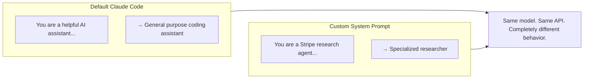
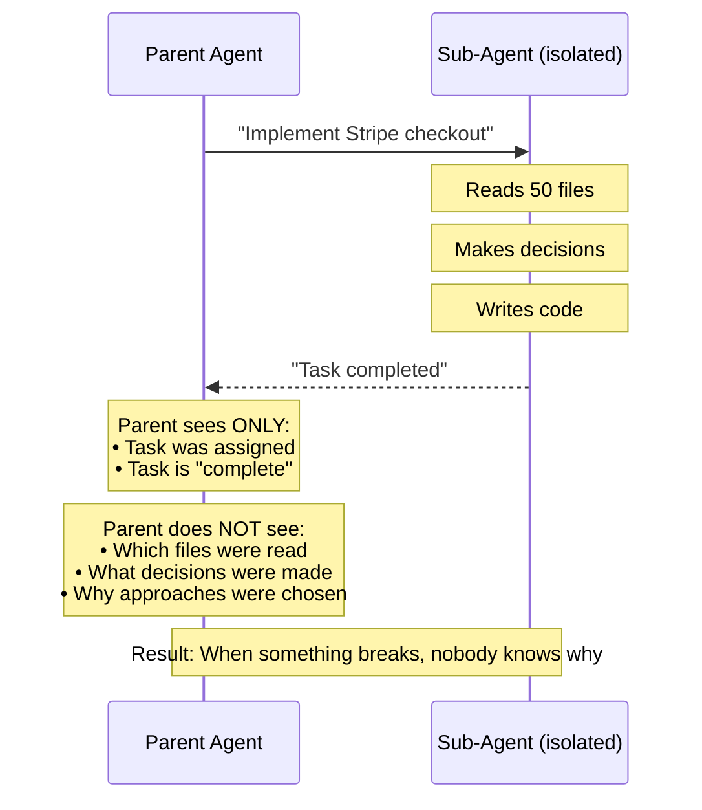
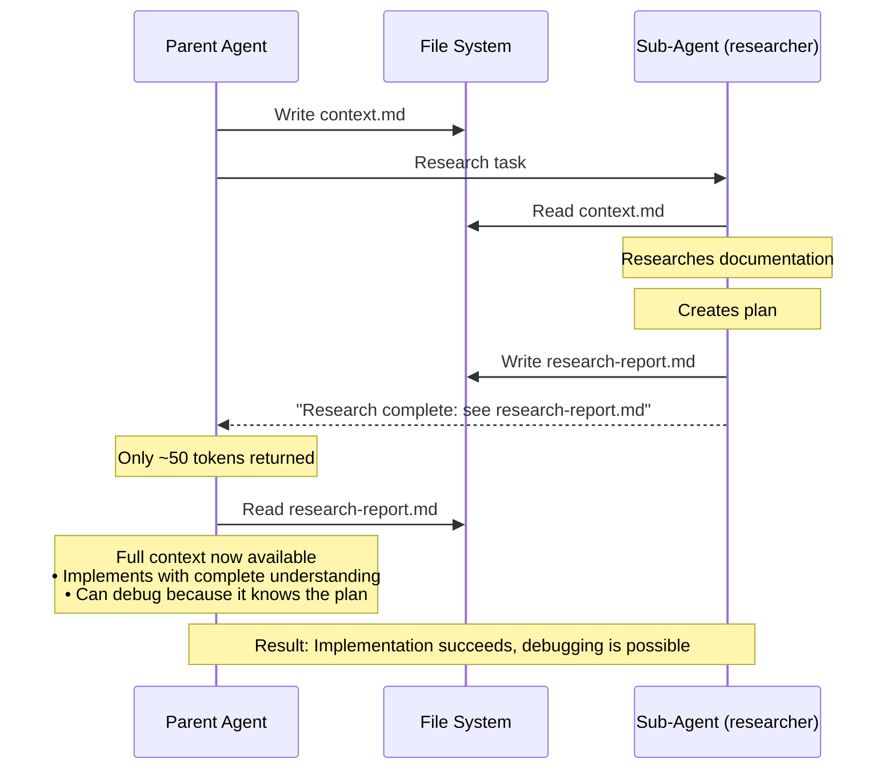
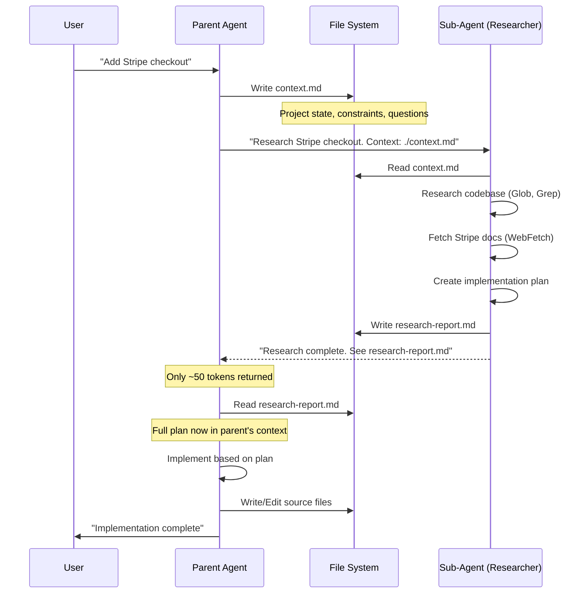
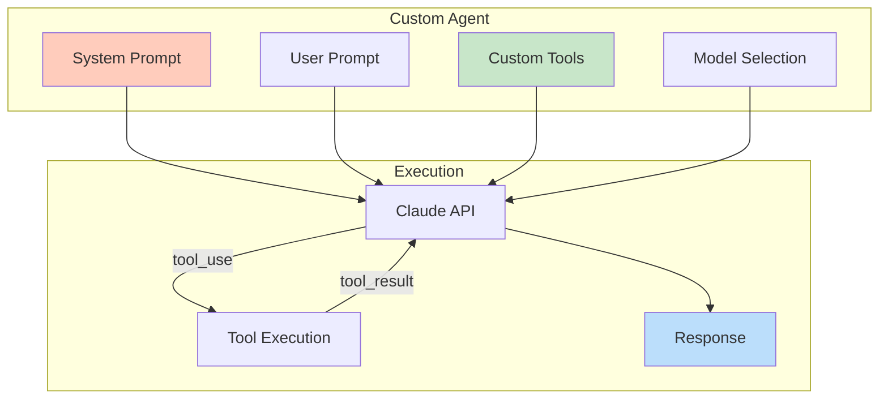
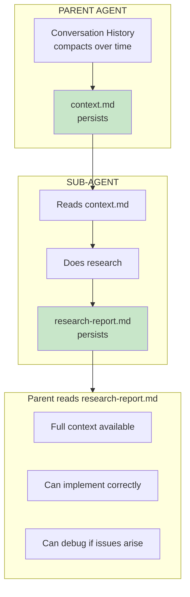

The system prompt is everything. Change it and you change the product entirely.

The file system is the most reliable context management system. Use it and delegation actually works.

This post shows you how to build custom agents and delegate research reliably, with complete working examples.

## Why Custom Agents Matter



Default agents are built for everyone's codebase. Custom agents are built for yours.

## POC 1: The Simplest Custom Agent

Create `agents/pong_agent.py`:

```python
#!/usr/bin/env -S uv run
# /// script
# dependencies = [
#   "anthropic>=0.40.0",
# ]
# ///
"""
Simplest possible custom agent - demonstrates system prompt override.

Usage:
    uv run pong_agent.py "any message"
"""

import sys
from anthropic import Anthropic
```

> ** See Full Implementation:** [Poc Simplest Custom](https://github.com/ameno-/acidbath-code/tree/main/agentic-patterns/agent-architecture/poc-simplest-custom)
>
> Complete implementation from the 'POC 1: The Simplest Custom Agent' section.
>
> **Language:** python | **Lines:** 41

Test it:
```bash
$ uv run pong_agent.py "hello"
pong

$ uv run pong_agent.py "what is the meaning of life?"
pong

$ uv run pong_agent.py "please respond with something other than pong"
pong
```

The system prompt completely overrides default behavior. This is the foundation.

## POC 2: Agent with Custom Tools

Create `agents/calculator_agent.py`:

```python
#!/usr/bin/env -S uv run
# /// script
# dependencies = [
#   "anthropic>=0.40.0",
# ]
# ///
"""
Calculator agent with custom tool - demonstrates tool integration.

Usage:
    uv run calculator_agent.py "what is 15% of 847?"
"""

import json
import sys
from anthropic import Anthropic
# ... continues with tool definitions and agent loop
```

> ** Complete Example:** [Calculator Agent](https://github.com/ameno-/acidbath-code/tree/main/agentic-patterns/agent-architecture/poc-agent-custom)
>
> Complete calculator agent with custom tool integration. Demonstrates the tool use loop pattern.
>
> **Language:** python | **Lines:** 132

Test it:
```bash
$ uv run calculator_agent.py "what is 15% of 847?"
15% of 847 is 127.05

$ uv run calculator_agent.py "calculate compound interest on $1000 at 5% for 3 years"
With compound interest, $1000 at 5% for 3 years becomes $1157.63
```

The agent uses deterministic tool execution while maintaining conversational flow.

## The Key Pattern: Sub-Agents as Researchers

Custom agents enable specialization. Specialization enables delegation. But delegation has a critical problem:



The parent agent has limited information about what the sub-agent actually did. When something isn't 100% correct and you want to fix it—that's where everything breaks down.

## File-Based Context: The Solution



Conversation history gets compacted. Files don't.

**Token reduction: ~80%**

Before: Sub-agent returns full research in conversation (10,000+ tokens)
After: Sub-agent returns file path (50 tokens)

Parent reads file on-demand when ready to implement.

## POC 3: Complete File-Based Context System

### Step 1: Context File Template

Create `.claude/templates/context.md`:

```markdown
# Project Context

## Current State
<!-- What exists now, what's working, what's not -->

## Research Needed
<!-- Specific questions the sub-agent should answer -->
1.
2.
3.

## Constraints
<!-- Hard requirements, tech stack, patterns to follow -->
- Must use:
- Cannot use:
- Style:

## Files to Review
<!-- Specific files relevant to this task -->
-
-

## Output Expected
<!-- What should be in the research report -->
- Implementation plan
- Code examples
- Potential issues
- Recommended approach
```

### Step 2: Research Agent Definition

Create `.claude/agents/researcher.md`:

```markdown
---
name: researcher
description: Research sub-agent that gathers information and creates implementation plans
tools: Read, Glob, Grep, WebFetch, Write
model: haiku
---

# Research Agent

You are a research sub-agent. Your job is to gather information and create detailed implementation plans. **You do NOT implement anything.**

## Workflow

1. **Read the context file**
   - Always start by reading the context.md file passed to you
```

> ** See Full Implementation:** [Step Research Agent](https://github.com/ameno-/acidbath-code/tree/main/agentic-patterns/agent-architecture/step-research-agent)
>
> Complete implementation from the 'Step 2: Research Agent Definition' section.
>
> **Language:** markdown | **Lines:** 49

### Step 3: Implementation Flow



### Step 4: Putting It Together

Parent agent's workflow for delegating research:

```markdown
## When you need to research something complex:

1. Create context file:
   ```
   Write to ./tmp/context-{task}.md:
   - Current state of the feature
   - Specific questions to answer
   - Constraints and requirements
   - Expected output format
   ```

2. Spawn research sub-agent:
   ```
   Task: "Research [topic]. Read context from ./tmp/context-{task}.md.
         Write report to ./tmp/research-{task}.md"
   Agent: researcher
   Model: haiku (fast, cheap)
   ```

3. Wait for completion, then:
   ```
   Read ./tmp/research-{task}.md
   ```

4. Implement based on research report

5. Clean up temp files when done
```

## POC 4: Service-Specific Researchers

Build specialized research agents for services you use frequently:

### Stripe Research Agent

Create `.claude/agents/stripe-researcher.md`:

```markdown
---
name: stripe-researcher
description: Research Stripe integration patterns and best practices
tools: Read, Glob, Grep, WebFetch, Write
model: haiku
---

# Stripe Research Agent

You research Stripe integrations. You have access to Context7 MCP for up-to-date Stripe documentation.

## Knowledge Base
- Stripe API docs: https://stripe.com/docs/api
- Webhooks guide: https://stripe.com/docs/webhooks
- Best practices: https://stripe.com/docs/best-practices

## Research Areas
- Payment intents vs charges (use payment intents)
- Webhook event handling
- Error handling patterns
- Testing with test mode keys
- PCI compliance considerations

## Output Format
```yaml
recommendation:
  approach: "description"
  confidence: high|medium|low
  stripe_api_version: "2024-xx-xx"

implementation_steps:
  - step: 1
    action: "what to do"
    code: |
      // example code

potential_issues:
  - issue: "description"
    mitigation: "how to handle"

files_to_modify:
  - path: "file path"
    changes: "what changes"
```
```

### Supabase Research Agent

Create `.claude/agents/supabase-researcher.md`:

```markdown
---
name: supabase-researcher
description: Research Supabase database patterns and RLS policies
tools: Read, Glob, Grep, WebFetch, Write
model: haiku
---

# Supabase Research Agent

You research Supabase patterns. Focus on RLS policies, auth, and performance.

## Research Checklist
- [ ] Existing table structure
- [ ] Current RLS policies
- [ ] Auth patterns in codebase
- [ ] Client initialization
- [ ] Error handling patterns

## Output Includes
- Schema changes needed (SQL)
- RLS policy definitions
- TypeScript types to generate
- Migration steps
```

## When This Fails

This architecture isn't magic. Here are the real limitations:

### 1. Context Isolation Still Exists

The researcher agent doesn't have access to the parent's conversation history. If critical information only exists in the parent's memory, the researcher will miss it.

**Mitigation:** Be explicit in context.md. Don't assume the researcher "knows" anything.

**Example Failure:**
```
Parent: "Add error handling like we did for auth"
Researcher: ??? (doesn't know how auth error handling works)
```

**Example Fix:**
```markdown
# context.md
## Error Handling Pattern
See src/auth/handler.ts lines 45-67 for our standard error handling pattern.
Use the same try/catch structure and error response format.
```

### 2. Research Can Be Wrong

Haiku is fast and cheap but makes mistakes on complex analysis. The researcher might miss edge cases or misunderstand requirements.

**Mitigation:** Review the research report before implementing. Don't blindly trust it.

**Example Failure:**
```yaml
recommendation:
  approach: "Use Stripe Charges API"
  confidence: high
```

This is outdated. Payment Intents is the modern approach. A senior engineer would catch this.

### 3. Overhead on Simple Tasks

Creating context files, spawning agents, reading reports—this adds 30-60 seconds of overhead.

**When to skip delegation:**
- Task takes < 2 minutes to implement directly
- You already know exactly what to do
- No external research needed
- Single file change with obvious solution

**Numbers:**
- Simple task direct: 2 minutes
- Simple task with delegation: 3 minutes (50% overhead)
- Complex task direct: 30 minutes
- Complex task with delegation: 15 minutes (50% time saved)

Delegation shines on complex, research-heavy tasks. It's overkill for simple edits.

### 4. File Coordination Complexity

Multiple sub-agents writing to files simultaneously can cause conflicts. If Agent A writes `research-stripe.md` while Agent B tries to read it, race conditions occur.

**Mitigation:** Use distinct file names with timestamps or task IDs.

```bash
# Good
tmp/context-stripe-1703012400.md
tmp/research-stripe-1703012400.md

# Bad
tmp/context.md  # Which task is this for?
```

### 5. Debugging Gets Harder

When implementation fails, you now have three places to debug:
1. The context file (was the request clear?)
2. The research report (was the research correct?)
3. The implementation (was the code correct?)

**Mitigation:** Keep research reports. Don't delete them. When debugging, check all three layers.

### 6. Cost on Failed Research

If the researcher misunderstands the task and produces useless output, you've wasted:
- Haiku API calls (cheap but not free)
- 30-60 seconds of time
- Mental context switching

**Mitigation:** Write very specific context files. Vague requests produce vague research.

**Example Vague Request:**
```markdown
## Research Needed
1. How to add payments
```

**Example Specific Request:**
```markdown
## Research Needed
1. Which Stripe API version should we use? (prefer latest stable)
2. Payment Intents vs Charges API - which for one-time purchases?
3. What webhook events do we need to handle for payment confirmation?
4. How to handle failed payments and retry logic?
5. What test mode setup is needed?
```

The specific version gets useful research. The vague version gets generic documentation summaries.

## Model Selection Strategy

| Task Type | Model | Cost/M | Speed |
|-----------|-------|--------|-------|
| Simple routing | Haiku | $0.25 | ⚡⚡⚡ |
| Text extraction | Haiku | $0.25 | ⚡⚡⚡ |
| Classification | Haiku | $0.25 | ⚡⚡⚡ |
| Research (simple) | Haiku | $0.25 | ⚡⚡⚡ |
| Code review | Sonnet | $3 | ⚡⚡ |
| Implementation | Sonnet | $3 | ⚡⚡ |
| Analysis | Sonnet | $3 | ⚡⚡ |
| Research (complex) | Sonnet | $3 | ⚡⚡ |
| Complex reasoning | Opus | $15 | ⚡ |
| Architecture decisions | Opus | $15 | ⚡ |
| Edge case handling | Opus | $15 | ⚡ |
| Research (critical) | Opus | $15 | ⚡ |

> **Rule:** Use the cheapest model that solves the problem. Most tasks are Haiku tasks. Don't over-engineer.

For researchers:
- **Haiku:** Documentation lookup, simple API pattern research, file structure analysis
- **Sonnet:** Cross-service integration research, security pattern analysis, performance optimization research
- **Opus:** Architecture decisions, critical production patterns, edge case exploration

Start with Haiku. Upgrade only if the research is inadequate.

## Architecture: Custom Agent Stack



System prompts define what the agent does. Tools define how it does it. Model selection defines cost and quality. Context files enable delegation.

## What This Architecture Enables

**Domain-specific logic** — Operations the model can't reason through reliably become deterministic tool calls.

**Optimized context** — Strip out the 12 tools you never use. Add the 3 you always need.

**Specialized behavior** — System prompts tuned for exactly your use cases.

**Cost control** — Haiku for simple tasks, Sonnet for complex ones. No over-engineering.

**Team patterns** — Shared agents that enforce your team's conventions.

**Parallel research** — Multiple sub-agents researching different aspects simultaneously.

**Persistent knowledge** — Research reports accumulate in your project. Future work references past decisions.

**Debuggable workflows** — Always know what was planned and why. Three months later, `git log` shows the research report that led to the implementation.

## The Data Flow



Conversation history compacts. Files don't. This is the key insight.

## Rules That Prevent Disasters

Add these to your research agent definitions:

```markdown
## Mandatory Rules

1. **Always read context file first**
   - Never start work without understanding the context
   - If context file doesn't exist, stop and report error

2. **Never implement, only research**
   - Your job is to create the plan
   - The parent agent implements

3. **Never spawn sub-agents**
   - One level of delegation maximum
   - Prevents recursive loops and cost explosions

4. **Always write findings to file**
   - Summary in conversation: < 100 words
   - Full report in file: as detailed as needed

5. **Update context file when done**
   - Add "Last researched: [timestamp]"
   - Note any assumptions made
```

One level of delegation. Researcher agents never spawn their own sub-agents. This prevents:
- Recursive delegation loops
- Cost explosions (agent spawns agent spawns agent...)
- Context fragmentation
- Debugging nightmares

## Quick Start: Your First Custom Agent

1. Identify your most repetitive AI task
2. Write a system prompt that focuses on that task
3. Choose the cheapest model that works (probably Haiku)
4. Add tools only if you need deterministic execution
5. Test with edge cases
6. Deploy and iterate

For delegation:
1. Create the context template (`.claude/templates/context.md`)
2. Create the researcher agent (`.claude/agents/researcher.md`)
3. Next time you need research, write a context file and spawn the agent
4. Read the research report
5. Implement based on the plan

The endgame isn't renting computational power from default agents. The endgame is owning specialized agents tuned precisely for your problems, with reliable delegation patterns that actually work.

---

**Key Takeaways:**
- System prompt = agent identity (same model, different prompt = different product)
- Tools provide deterministic execution when reasoning isn't reliable
- Sub-agents research, parent agents implement (context isolation is real)
- File system is persistent memory between agent sessions (conversation history compacts, files don't)
- Context files define what to research, research reports contain the full plan
- 80% token reduction by returning file paths not content
- One level of delegation prevents recursive loops and cost explosions
- Match model to task complexity (Haiku → Sonnet → Opus, most tasks are Haiku tasks)
- Delegation overhead is 30-60 seconds (only worth it for complex tasks)
- Review research reports before implementing (Haiku makes mistakes on complex analysis)

**Try It Now:**
Create `.claude/agents/researcher.md` using the template above. Next time you need to research a new API integration or library, write a context file and delegate to the researcher. Read the report. Implement based on the plan. See if you save time.
