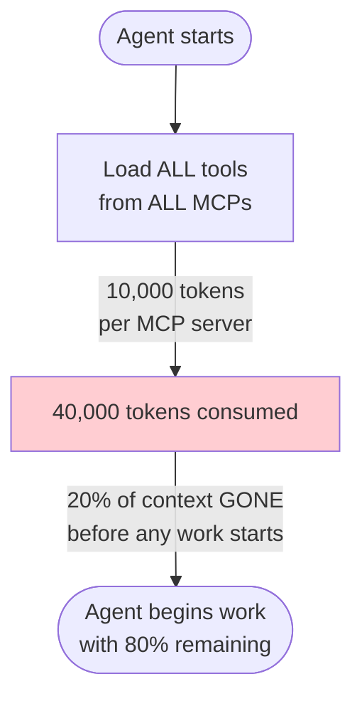
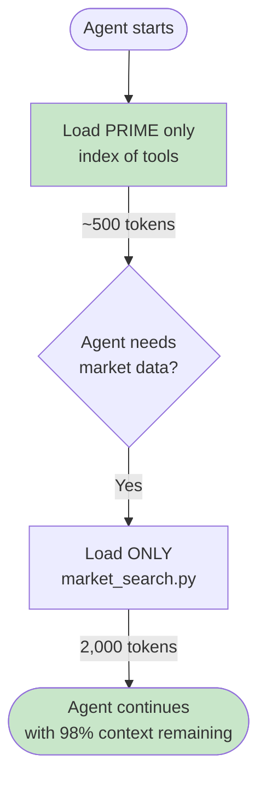
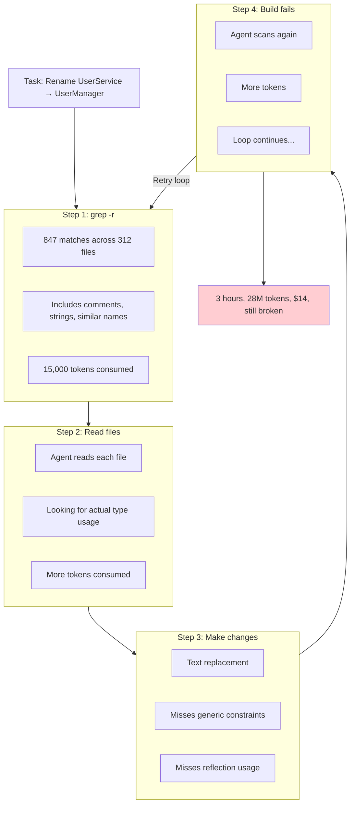
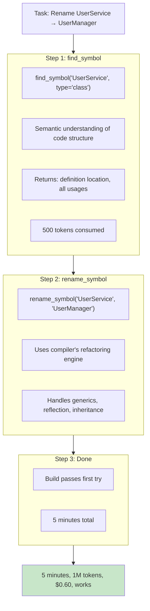
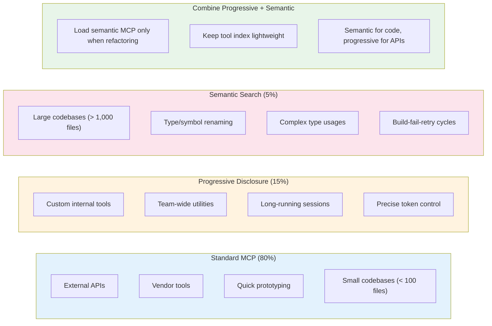

Context is finite. Every token your agent loads before it starts working is a tax on productivity.

This post shows you how to engineer context consumption—from basic token optimization with progressive disclosure, to large codebase mastery with semantic search. Working code, hard numbers, honest failure modes included.

## The Core Problem: Context is Precious

Your context window is your budget. MCP servers spend it like a trust fund kid.



Four MCP servers at 10,000 tokens each = 40,000 tokens consumed before you type a single character.

If tools consume more than 15% of your context, you have an architecture problem. For many use cases, [Claude Skills](/blog/claude-skills-deep-dive) offer a lighter-weight alternative—loading ~100 tokens of metadata upfront and only fetching full instructions when triggered.

## Pattern 1: Progressive Disclosure

Progressive disclosure loads tools only when needed. Instead of front-loading everything, give your agent an index of what exists—and let it load only what it uses.



Result: 2,500 tokens instead of 40,000. 94% reduction.

### Implementation: Tool Index + UV Scripts

Create a tool index as a simple markdown file:

**`~/tools/README.md`**
```markdown
# Available Tools

You have access to the following tool scripts. **Do not read script contents unless --help doesn't provide enough information.**

## Market Tools
Located in: `~/tools/market/`
- `search.py` - Search prediction markets by keyword
- `get_market.py` - Get details for specific market ID
- `get_orderbook.py` - Get current orderbook for market

## Data Tools
Located in: `~/tools/data/`
- `fetch_csv.py` - Download CSV from URL
- `analyze_csv.py` - Basic statistical analysis
- `transform_csv.py` - Transform/filter CSV data

## When you need a tool:
1. Run `uv run ~/tools/{category}/{script}.py --help`
2. Read the help output to understand usage
3. Run the tool with appropriate arguments
4. Only read script source if help is insufficient
```

This index costs ~200 tokens. The agent knows WHERE tools are without loading them.

Each tool is a UV single-file script with embedded dependencies:

**`~/tools/market/search.py`**
```python
# github: https://github.com/ameno-/acidbath-code/blob/main/agentic-patterns/context-engineering/search.py
#!/usr/bin/env -S uv run
# /// script
# dependencies = [
#   "requests>=2.31.0",
#   "rich>=13.0.0",
# ]
# ///
"""
Search prediction markets by keyword.

Usage:
    uv run search.py --query "election" [--limit 10]

Arguments:
    --query, -q    Search term (required)
    --limit, -l    Max results (default: 10)
    --format, -f   Output format: json|table (default: table)
"""

import argparse
import json
import requests
from rich.console import Console
from rich.table import Table

KALSHI_API = "https://trading-api.kalshi.com/trade-api/v2"

def search_markets(query: str, limit: int = 10) -> list:
    """Search Kalshi markets by keyword."""
    response = requests.get(
        f"{KALSHI_API}/markets",
        params={"status": "open", "limit": limit},
        headers={"Accept": "application/json"}
    )
    response.raise_for_status()

    markets = response.json().get("markets", [])
    # Filter by query in title
    return [m for m in markets if query.lower() in m.get("title", "").lower()][:limit]

def main():
    parser = argparse.ArgumentParser(description="Search prediction markets")
    parser.add_argument("-q", "--query", required=True, help="Search term")
    parser.add_argument("-l", "--limit", type=int, default=10, help="Max results")
    parser.add_argument("-f", "--format", choices=["json", "table"], default="table")

    args = parser.parse_args()

    markets = search_markets(args.query, args.limit)

    if args.format == "json":
        print(json.dumps(markets, indent=2))
    else:
        console = Console()
        table = Table(title=f"Markets matching '{args.query}'")
        table.add_column("ID", style="cyan")
        table.add_column("Title", style="green")
        table.add_column("Volume", justify="right")

        for m in markets:
            table.add_row(
                m.get("ticker", ""),
                m.get("title", "")[:50],
                str(m.get("volume", 0))
            )

        console.print(table)

if __name__ == "__main__":
    main()
```

### The Flow in Practice

```
User: "What's the current price on election markets?"

Agent:
1. Reads ~/tools/README.md (200 tokens)
2. Sees market/search.py exists
3. Runs: uv run ~/tools/market/search.py --help (500 tokens)
4. Learns usage from help output
5. Runs: uv run ~/tools/market/search.py -q "election"
6. Returns results

Total context: ~2,700 tokens
MCP equivalent: ~10,000 tokens
```

### Progressive Disclosure Numbers

| Approach | Initial Load | Per-Tool Cost | 4 Tools Used |
|----------|-------------|---------------|--------------|
| MCP Server | 10,000 tokens | 0 (pre-loaded) | 10,000 |
| Progressive | 200 tokens | 500-2,000 | 2,200-8,200 |

Progressive disclosure wins when you use fewer than all available tools—which is almost always. Most tasks use 2-3 tools out of 20 available.

For taking this pattern further, see [Single-File Scripts](/blog/single-file-scripts)—UV and Bun scripts that replace entire MCP servers with zero-config executables.

## Pattern 2: Semantic Search for Large Codebases

Progressive disclosure optimizes tool loading. But when you're working with large codebases, the problem isn't tool overhead—it's search strategy.

Brute-force text search doesn't scale. Semantic search does.

### Why Text Search Fails



The build-fail-retry cycle is the productivity bottleneck. Text search guarantees you'll hit it.

### How Semantic Search Works



The key difference:
- Text search: "Find this string anywhere"
- Semantic search: "Find this symbol in the AST"

Semantic search understands code structure. It knows the difference between a type name, a string literal that happens to contain that text, and a comment mentioning it.

### Setting Up Serena MCP

Serena provides semantic search for multiple languages (TypeScript, JavaScript, Python, Go, Rust).

**Installation:**

```bash
# Clone the repository
git clone https://github.com/oramasearch/serena.git
cd serena

# Install dependencies
npm install

# Build the project
npm run build
```

**Configuration for Claude Code:**

Add to `~/.claude/mcp.json`:

```json
{
  "mcpServers": {
    "serena": {
      "command": "node",
      "args": ["/absolute/path/to/serena/dist/index.js"],
      "env": {
        "PROJECT_ROOT": "."
      }
    }
  }
}
```

**Available tools:**

| Tool | Description |
|------|-------------|
| `find_symbol` | Find symbol definition and all usages |
| `find_references` | Find all references to a symbol |
| `get_definition` | Get the definition of a symbol at a location |
| `semantic_search` | Search code semantically, not just text |
| `get_file_symbols` | List all symbols in a file |

### Adding Language-Specific Refactoring

For C#/.NET, add Refactor MCP for Roslyn-powered operations:

```bash
# Clone the repository
git clone https://github.com/JetBrains/refactor-mcp.git
cd refactor-mcp

# Build
dotnet build
```

Add to MCP config:

```json
{
  "mcpServers": {
    "refactor": {
      "command": "dotnet",
      "args": ["run", "--project", "/path/to/refactor-mcp"],
      "env": {
        "SOLUTION_PATH": "/path/to/your/solution.sln"
      }
    }
  }
}
```

**Available refactoring operations:**

| Tool | Description |
|------|-------------|
| `rename_symbol` | Rename with full semantic awareness |
| `extract_method` | Extract code into a new method |
| `inline_method` | Inline a method at call sites |
| `extract_interface` | Create interface from class |
| `move_type` | Move type to another file/namespace |

### The Numbers: 55,000 File Codebase

Real measurements from a production codebase:

| Metric | Text Search | Semantic Search | Improvement |
|--------|-------------|-----------------|-------------|
| Time | 3 hours | 5 minutes | 36x |
| Tokens | 28M | 1M | 28x |
| Cost | $14 | $0.60 | 23x |
| Human intervention | Constant | None | ∞ |
| Build failures | 4 | 0 | - |

The cost of NOT having semantic tools scales with codebase size. A 10x larger codebase isn't 10x worse—it's 100x worse with text search.

### Workflow Comparison

**Without semantic tools (3 hours):**

```
User: "Rename UserService to UserManager across the codebase"

Agent:
1. grep -r "UserService" . → 847 results
2. Read 312 files → 28M tokens consumed
3. Text-replace in each file
4. Build fails (missed generic constraints)
5. grep again for the error
6. Fix, rebuild
7. Build fails (missed reflection usage)
8. Loop continues...

Result: 3 hours, multiple human interventions, $14
```

**With semantic tools (5 minutes):**

```
User: "Rename UserService to UserManager across the codebase"

Agent:
1. find_symbol("UserService") → 42 actual usages
2. rename_symbol("UserService", "UserManager")
3. Build passes

Result: 5 minutes, autonomous, $0.60
```

## When This Fails: Honest Limitations

Both patterns have failure modes. Here's what doesn't work.

### Progressive Disclosure Failures

**Setup overhead becomes the bottleneck:**
- If you're prototyping and need 15 different tools quickly, progressive disclosure adds friction
- Writing UV scripts and maintaining a tool index takes time
- For one-off tasks, the setup cost exceeds the savings

**Language and dependency constraints:**
- UV is Python-focused; other languages need different patterns
- Binary tools require wrapper scripts
- Complex authentication flows are harder to embed in single files

**When tool reuse is low:**
- If every task needs a new custom script, you're not saving context
- The index becomes noise if most tools are one-time use

### Semantic Search Failures

**Initial indexing cost:**
- First run on a large codebase can take minutes to hours
- Index storage can be GBs for very large projects
- Re-indexing after major refactors adds overhead

**Language support gaps:**
- Not all languages have mature semantic tooling
- Dynamic languages (Ruby, PHP) have weaker semantic analysis
- Mixed codebases (Python + JavaScript + Go) need multiple MCP servers

**False confidence in refactoring:**
- Semantic tools can't catch runtime-only issues
- Reflection-heavy code may still break
- Cross-service boundaries aren't tracked

**Setup complexity:**
- Requires building/installing language-specific servers
- Configuration mistakes lead to silent failures
- Version mismatches between tools and target code

**Cost isn't always lower:**
- For small codebases (< 100 files), text search is faster
- For simple string replacements, grep is sufficient
- If you only search once, indexing overhead dominates

## Decision Framework: When to Use Which Pattern



### The Selection Test

Ask these questions:

1. **How many files will be touched?**
   - < 10 files: Text search is fine
   - 10-100 files: Text search with careful prompting
   - 100-1,000 files: Consider semantic
   - 1,000+ files: Semantic is required

2. **How many tools will be used?**
   - All of them: MCP upfront loading is fine
   - Most of them: MCP is fine
   - Some of them: Progressive disclosure wins
   - Few of them: Progressive disclosure wins heavily

3. **What's the task complexity?**
   - String replacement: Text search works
   - Symbol renaming: Semantic required
   - Cross-file refactoring: Semantic required
   - Type hierarchy changes: Semantic required

4. **Is this a one-off or repeated work?**
   - One-off: Setup cost dominates, use simple tools
   - Repeated: Setup cost amortizes, invest in optimization

## Key Takeaways

- Context is finite; every pre-loaded token is a tax on productivity
- Progressive disclosure reduces tool overhead by 90%+ when you don't use all tools
- Semantic search provides 28x token reduction and 36x speed improvement on large codebases
- Combine both: use progressive disclosure for tool loading, semantic search for code operations
- Text search fails at scale due to build-fail-retry cycles
- Setup overhead is real; optimize only when the math supports it
- Most codebases (< 100 files) don't need semantic tools
- Tool sophistication matters more than raw model capability for large codebases

## Try It Now

**For progressive disclosure:**
Create `~/tools/README.md` with an index of 3 UV scripts. Point your agent at it instead of loading an MCP server. Track token consumption with `/context` in Claude Code.

**For semantic search:**
Install Serena MCP. Run `find_symbol` on a type in your codebase. Compare the results and token usage to `grep -r`. If you're touching more than 100 files, measure the difference.

The best context engineering is invisible. Your agent just works faster, costs less, and fails less often.
