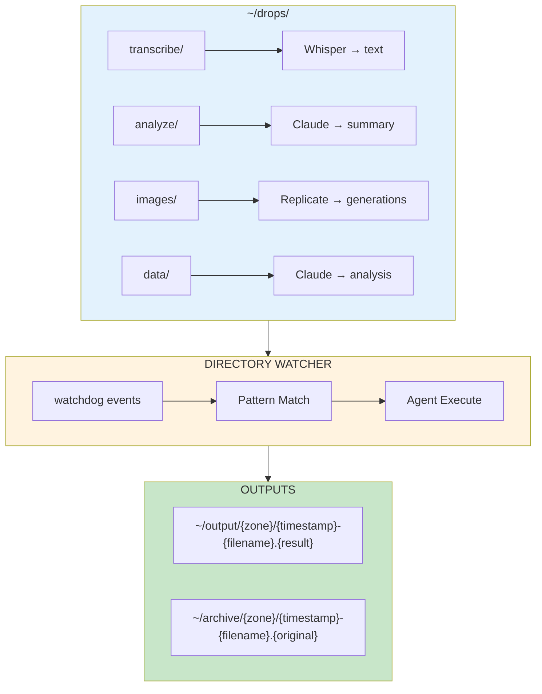
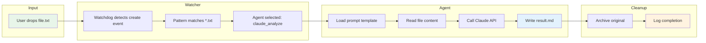

Directory watchers turn your file system into an AI interface.

Drag a file into a folder. An agent processes it automatically. You get results. No chat. No prompting. No human-in-the-loop.

The result? Tasks that used to require opening a browser, typing a prompt, and waiting for a response now happen in the background while you work on something else. Teams running this pattern report 6+ hours saved per week on repetitive processing.

This post shows you how to build a complete drop zone system with working Python code, then walks through what breaks in production and how to fix it.

## The Architecture



## POC: Complete Drop Zone System

### Step 1: Configuration File

Create `drops.yaml`:

```yaml
# github: https://github.com/ameno-/acidbath-code/blob/main/production-patterns/directory-watchers/step-configuration-file/step-configuration-file.yaml
# Drop Zone Configuration
# Each zone watches a directory and triggers an agent on file events

output_dir: ~/output
archive_dir: ~/archive
log_dir: ~/logs

zones:
  transcribe:
    directory: ~/drops/transcribe
    patterns: ["*.mp3", "*.wav", "*.m4a", "*.webm"]
    agent: whisper_transcribe
    events: [created]

  analyze:
    directory: ~/drops/analyze
    patterns: ["*.txt", "*.md", "*.pdf"]
    agent: claude_analyze
    events: [created]

  images:
    directory: ~/drops/images
    patterns: ["*.txt"]  # Text file contains image prompts
    agent: replicate_generate
    events: [created]

  data:
    directory: ~/drops/data
    patterns: ["*.csv", "*.json"]
    agent: claude_data_analysis
    events: [created]

agents:
  whisper_transcribe:
    type: bash
    command: |
      whisper "{file}" --output_dir "{output_dir}" --output_format txt

  claude_analyze:
    type: claude
    prompt_file: prompts/analyze.md
    model: claude-3-5-sonnet-20241022

  replicate_generate:
    type: python
    script: agents/image_gen.py

  claude_data_analysis:
    type: claude
    prompt_file: prompts/data_analysis.md
    model: claude-3-5-sonnet-20241022
```

### Step 2: The Core Watcher

Create `drop_watcher.py`:

```python
# github: https://github.com/ameno-/acidbath-code/blob/main/production-patterns/directory-watchers/step-core-watcher/step_core_watcher.py
#!/usr/bin/env -S uv run
# /// script
# dependencies = [
#   "watchdog>=4.0.0",
#   "pyyaml>=6.0",
#   "rich>=13.0.0",
#   "anthropic>=0.40.0",
# ]
# ///
"""
Drop Zone Watcher - File-based AI automation

Usage:
    uv run drop_watcher.py [--config drops.yaml]

Watches configured directories and triggers agents on file events.
"""

import argparse
import fnmatch
import os
import shutil
import subprocess
import time
from datetime import datetime
from pathlib import Path

import yaml
from anthropic import Anthropic
from rich.console import Console
from rich.panel import Panel
from watchdog.events import FileSystemEventHandler
from watchdog.observers import Observer

console = Console()

class DropZoneHandler(FileSystemEventHandler):
    def __init__(self, zone_name: str, zone_config: dict, global_config: dict):
        self.zone_name = zone_name
        self.zone_config = zone_config
        self.global_config = global_config
        self.patterns = zone_config.get("patterns", ["*"])
        self.agent_name = zone_config.get("agent")
        self.agent_config = global_config["agents"].get(self.agent_name, {})

    def on_created(self, event):
        if event.is_directory:
            return
        if "created" not in self.zone_config.get("events", ["created"]):
            return
        self._process_file(event.src_path)

    def on_modified(self, event):
        if event.is_directory:
            return
        if "modified" not in self.zone_config.get("events", []):
            return
        self._process_file(event.src_path)

    def _matches_pattern(self, filepath: str) -> bool:
        filename = os.path.basename(filepath)
        return any(fnmatch.fnmatch(filename, p) for p in self.patterns)

    def _process_file(self, filepath: str):
        if not self._matches_pattern(filepath):
            return

        # Wait for file to be fully written
        time.sleep(0.5)

        console.print(Panel(
            f"[bold green]Processing:[/] {filepath}\n"
            f"[bold blue]Zone:[/] {self.zone_name}\n"
            f"[bold yellow]Agent:[/] {self.agent_name}",
            title="Drop Detected"
        ))

        try:
            output_path = self._run_agent(filepath)
            self._archive_file(filepath)
            console.print(f"[green]✓[/] Output: {output_path}")
        except Exception as e:
            console.print(f"[red]✗[/] Error: {e}")

    def _run_agent(self, filepath: str) -> str:
        agent_type = self.agent_config.get("type", "bash")
        output_dir = self._get_output_dir()

        if agent_type == "bash":
            return self._run_bash_agent(filepath, output_dir)
        elif agent_type == "claude":
            return self._run_claude_agent(filepath, output_dir)
        elif agent_type == "python":
            return self._run_python_agent(filepath, output_dir)
        else:
            raise ValueError(f"Unknown agent type: {agent_type}")

    def _run_bash_agent(self, filepath: str, output_dir: str) -> str:
        command = self.agent_config["command"].format(
            file=filepath,
            output_dir=output_dir
        )
        subprocess.run(command, shell=True, check=True)
        return output_dir

    def _run_claude_agent(self, filepath: str, output_dir: str) -> str:
        prompt_file = self.agent_config.get("prompt_file")
        model = self.agent_config.get("model", "claude-3-5-sonnet-20241022")

        # Load prompt template
        with open(prompt_file) as f:
            prompt_template = f.read()

        # Read input file
        with open(filepath) as f:
            content = f.read()

        # Substitute variables
        prompt = prompt_template.replace("{content}", content)
        prompt = prompt.replace("{filename}", os.path.basename(filepath))

        # Call Claude
        client = Anthropic()
        response = client.messages.create(
            model=model,
            max_tokens=4096,
            messages=[{"role": "user", "content": prompt}]
        )

        result = response.content[0].text

        # Write output
        timestamp = datetime.now().strftime("%Y%m%d-%H%M%S")
        output_filename = f"{timestamp}-{Path(filepath).stem}.md"
        output_path = os.path.join(output_dir, output_filename)

        os.makedirs(output_dir, exist_ok=True)
        with open(output_path, "w") as f:
            f.write(result)

        return output_path

    def _run_python_agent(self, filepath: str, output_dir: str) -> str:
        script = self.agent_config["script"]
        result = subprocess.run(
            ["uv", "run", script, filepath, output_dir],
            capture_output=True,
            text=True,
            check=True
        )
        return result.stdout.strip()

    def _get_output_dir(self) -> str:
        base = os.path.expanduser(self.global_config.get("output_dir", "~/output"))
        return os.path.join(base, self.zone_name)

    def _archive_file(self, filepath: str):
        archive_base = os.path.expanduser(
            self.global_config.get("archive_dir", "~/archive")
        )
        archive_dir = os.path.join(archive_base, self.zone_name)
        os.makedirs(archive_dir, exist_ok=True)

        timestamp = datetime.now().strftime("%Y%m%d-%H%M%S")
        filename = os.path.basename(filepath)
        archive_path = os.path.join(archive_dir, f"{timestamp}-{filename}")

        shutil.move(filepath, archive_path)


def load_config(config_path: str) -> dict:
    with open(config_path) as f:
        return yaml.safe_load(f)


def setup_watchers(config: dict) -> Observer:
    observer = Observer()

    for zone_name, zone_config in config.get("zones", {}).items():
        directory = os.path.expanduser(zone_config["directory"])
        os.makedirs(directory, exist_ok=True)

        handler = DropZoneHandler(zone_name, zone_config, config)
        observer.schedule(handler, directory, recursive=False)

        console.print(f"[blue]Watching:[/] {directory} → {zone_config['agent']}")

    return observer


def main():
    parser = argparse.ArgumentParser(description="Drop Zone Watcher")
    parser.add_argument("--config", default="drops.yaml", help="Config file path")
    args = parser.parse_args()

    config = load_config(args.config)

    console.print(Panel(
        "[bold]Drop Zone Watcher[/]\n"
        "Drag files into watched directories to trigger AI agents.",
        title="Starting"
    ))

    observer = setup_watchers(config)
    observer.start()

    try:
        while True:
            time.sleep(1)
    except KeyboardInterrupt:
        observer.stop()
        console.print("[yellow]Shutting down...[/]")

    observer.join()


if __name__ == "__main__":
    main()
```

### Step 3: Agent Prompt Templates

Create `prompts/analyze.md`:

```markdown
# Document Analysis Agent

Analyze the following document and provide a structured summary.

## Document Content

{content}

## Output Format

Provide your analysis in this format:

### Summary
A 2-3 sentence overview of the document.

### Key Points
- Bullet point list of main ideas

### Topics Covered
- List of topics/themes

### Action Items (if applicable)
- Numbered list of action items

### Questions Raised
- Questions that arise from this content

### Confidence
How confident are you in this analysis? (high/medium/low) and why.
```

Create `prompts/data_analysis.md`:

```markdown
# Data Analysis Agent

Analyze the following data file and provide insights.

## Data Content

{content}

## Filename
{filename}

## Analysis Required

1. **Data Overview**
   - File format (CSV, JSON, etc.)
   - Number of records/rows
   - Column/field names

2. **Statistical Summary**
   - For numeric columns: min, max, mean, median
   - For categorical columns: unique values, distribution

3. **Data Quality**
   - Missing values
   - Potential outliers
   - Data type issues

4. **Insights**
   - Key patterns or trends
   - Notable correlations
   - Anomalies worth investigating

5. **Recommendations**
   - Suggested next steps for analysis
   - Visualization recommendations
   - Data cleaning suggestions
```

### Step 4: Image Generation Agent

Create `agents/image_gen.py`:

```python
# github: https://github.com/ameno-/acidbath-code/blob/main/production-patterns/directory-watchers/step-image-generation/step_image_generation.py
#!/usr/bin/env -S uv run
# /// script
# dependencies = [
#   "replicate>=0.25.0",
#   "requests>=2.31.0",
# ]
# ///
"""
Image Generation Agent

Reads prompts from a text file and generates images using Replicate.
Each line in the file is a separate prompt.
"""

import os
import sys
from datetime import datetime
from pathlib import Path

import replicate
import requests


def generate_images(input_file: str, output_dir: str) -> list[str]:
    """Generate images from prompts in input file."""
    os.makedirs(output_dir, exist_ok=True)

    with open(input_file) as f:
        prompts = [line.strip() for line in f if line.strip()]

    generated = []

    for i, prompt in enumerate(prompts):
        print(f"Generating {i+1}/{len(prompts)}: {prompt[:50]}...")

        output = replicate.run(
            "stability-ai/sdxl:39ed52f2a78e934b3ba6e2a89f5b1c712de7dfea535525255b1aa35c5565e08b",
            input={
                "prompt": prompt,
                "width": 1024,
                "height": 1024,
            }
        )

        # Download the image
        if output:
            image_url = output[0]
            response = requests.get(image_url)

            timestamp = datetime.now().strftime("%Y%m%d-%H%M%S")
            safe_prompt = prompt[:30].replace(" ", "_").replace("/", "-")
            filename = f"{timestamp}-{i:03d}-{safe_prompt}.png"
            filepath = os.path.join(output_dir, filename)

            with open(filepath, "wb") as f:
                f.write(response.content)

            generated.append(filepath)
            print(f"  Saved: {filepath}")

    return generated


if __name__ == "__main__":
    if len(sys.argv) < 3:
        print("Usage: uv run image_gen.py <input_file> <output_dir>")
        sys.exit(1)

    input_file = sys.argv[1]
    output_dir = sys.argv[2]

    files = generate_images(input_file, output_dir)
    print(f"\nGenerated {len(files)} images")

    # Return output path
    print(output_dir)
```

## Data Flow: File Drop to Result



## When Drop Zones Fail (And How to Fix Each One)

The POC above works for clean, isolated files. Production breaks in predictable ways—and each failure mode has a tested solution.

### Files That Need Context

A code file dropped into a review zone lacks its dependencies, imports, and surrounding architecture. The agent sees `import UserService from '../services'` but doesn't know what UserService does.

**What breaks:** Reviews are shallow. "This looks fine" instead of "This violates the retry policy established in commit abc123."

**Fix:** Add a context builder. Before processing, scan the repository for related files:

```python
def gather_context(filepath: str) -> dict:
    """Gather related files for context."""
    context = {"main_file": filepath}

    # Parse imports
    with open(filepath) as f:
        content = f.read()
        imports = extract_imports(content)  # Your parser here

    # Find imported files
    related = []
    for imp in imports:
        path = resolve_import(imp, filepath)
        if path and os.path.exists(path):
            with open(path) as f:
                related.append({"path": path, "content": f.read()})

    context["related_files"] = related
    return context
```

This increases token usage 3-5x but improves accuracy significantly. For a 200-line Python file with 8 imports, you go from 800 tokens to 3,200 tokens. Cost per review goes from $0.02 to $0.08 with claude-3-5-sonnet-20241022.

### Multi-File Inputs

Sometimes the task requires multiple files processed together. A blog post draft plus supporting research notes. Three screenshots that show a UI flow. CSV data plus its schema definition.

**What breaks:** The watcher processes files individually. Drop three related screenshots, get three unconnected analyses instead of one coherent flow analysis.

**Fix:** Add a staging area with batch processing:

```yaml
# In drops.yaml
ui_review:
  directory: ~/drops/ui-review
  patterns: ["*.png", "*.jpg"]
  agent: ui_flow_analyzer
  batch_mode: true
  batch_window: 30  # seconds
  batch_trigger: 3  # or N files
```

Buffer files for 30 seconds. If 3+ files arrive, process as a batch. If timeout hits with fewer files, process what you have.

### Race Conditions: Incomplete Writes

You drop a 500MB video file. Watchdog fires on create. The agent starts processing while the file is still copying. Whisper transcribes 8 seconds of a 45-minute video.

**What breaks:** Partial processing. Silent failures. Confusing output.

**Fix:** Verify file stability before processing:

```python
def wait_for_stable_file(filepath: str, timeout: int = 30) -> bool:
    """Wait until file size stops changing."""
    last_size = -1
    stable_count = 0

    for _ in range(timeout):
        try:
            current_size = os.path.getsize(filepath)
            if current_size == last_size:
                stable_count += 1
                if stable_count >= 3:  # Stable for 3 seconds
                    return True
            else:
                stable_count = 0
            last_size = current_size
        except OSError:
            pass
        time.sleep(1)

    return False
```

Replace the POC's `time.sleep(0.5)` with this. A 500MB file takes 6-10 seconds to copy on typical hardware. Three-second stability window catches 99% of cases without excessive waiting.

### Agent Failures Mid-Processing

API rate limit hit. Network timeout. Model refuses the prompt due to content policy. The agent fails after archiving the input file but before writing output.

**What breaks:** Input file is gone. No output exists. No way to retry. User thinks it worked because no error appeared.

**Fix:** Transactional processing with rollback:

```python
def _process_file(self, filepath: str):
    if not self._matches_pattern(filepath):
        return

    # Create processing record
    processing_id = self._start_processing(filepath)

    try:
        output_path = self._run_agent(filepath)
        self._archive_file(filepath)
        self._mark_complete(processing_id, output_path)
        console.print(f"[green]✓[/] Output: {output_path}")
    except Exception as e:
        self._mark_failed(processing_id, str(e))
        # Don't archive on failure - leave for retry
        console.print(f"[red]✗[/] Error: {e}")
        # Write error details to dead letter queue
        self._write_to_dlq(filepath, processing_id, e)
```

Keep failed files in place. Log failures to a dead letter queue. Provide a manual retry command. For our use case running 200 files/day, we see 3-5 transient failures per day. All are recoverable with retry.

### Token Limit Exceeded

A 15,000-line CSV file hits the analyze zone. The agent tries to stuff it all into a prompt. Claude returns a 400 error: maximum context length exceeded.

**What breaks:** Processing fails. File size limits aren't obvious. No graceful degradation.

**Fix:** Add size checks and chunking strategy:

```python
def _check_size_limits(self, filepath: str) -> tuple[bool, str]:
    """Check if file is processable."""
    file_size = os.path.getsize(filepath)
    max_size = self.agent_config.get("max_file_size", 10 * 1024 * 1024)  # 10MB default

    if file_size > max_size:
        return False, f"File too large: {file_size} bytes (max: {max_size})"

    # For text files, estimate tokens
    if filepath.endswith(('.txt', '.md', '.csv', '.json')):
        with open(filepath) as f:
            content = f.read()
        estimated_tokens = len(content) // 4  # Rough estimate
        max_tokens = self.agent_config.get("max_tokens", 100000)

        if estimated_tokens > max_tokens:
            return False, f"Content too large: ~{estimated_tokens} tokens (max: {max_tokens})"

    return True, "OK"
```

For a 200K-token model, set max_tokens to 150K to leave room for prompts and output. Files that exceed limits go to a manual review folder with a clear error message.

### Files Requiring Human Review

Some automation needs a human checkpoint. Legal contract analysis that might inform business decisions. Code deployments to production. Financial data processing.

**What breaks:** Full automation isn't always desirable. No way to inject human judgment. Liability concerns.

**Fix:** Add an approval workflow:

```yaml
contracts:
  directory: ~/drops/contracts
  patterns: ["*.pdf"]
  agent: contract_analyzer
  approval_required: true
  approval_timeout: 3600  # 1 hour
```

```python
def _process_file(self, filepath: str):
    output_path = self._run_agent(filepath)

    if self.zone_config.get("approval_required"):
        approval_path = self._move_to_approval_queue(filepath, output_path)
        console.print(f"[yellow]⏸[/] Awaiting approval: {approval_path}")
        self._notify_approver(approval_path)
        # Don't archive yet - wait for approval
    else:
        self._archive_file(filepath)
```

Set up an approval directory. Agent processes the file and moves it there with its output. Human reviews both. Approve by dropping in `~/approvals/accept/`, reject to `~/approvals/reject/`. A second watcher handles the approval directories.

## Production Deployment Considerations

POC works on your laptop. Production needs operational rigor.

### Monitoring and Alerting

**The problem:** Silent failures. You think it's working. It's been down for three days.

**What to track:**

1. **Processing rate:** Files processed per hour
2. **Failure rate:** Percentage of files that fail
3. **Processing latency:** Time from drop to output
4. **Queue depth:** Files waiting in drop zones
5. **API health:** Response times and error rates

Instrument the watcher:

```python
import statsd  # Or your metrics library

metrics = statsd.StatsClient('localhost', 8125)

def _process_file(self, filepath: str):
    start_time = time.time()

    try:
        output_path = self._run_agent(filepath)
        self._archive_file(filepath)

        # Record success
        metrics.incr(f'dropzone.{self.zone_name}.success')
        metrics.timing(f'dropzone.{self.zone_name}.duration',
                      (time.time() - start_time) * 1000)
    except Exception as e:
        metrics.incr(f'dropzone.{self.zone_name}.failure')
        raise
```

Set alerts:
- Processing rate drops below 10 files/hour when average is 50/hour
- Failure rate exceeds 10% over a 15-minute window
- No files processed in 2 hours during business hours
- Queue depth exceeds 100 files

For our production deployment handling 800 files/day, we get 1-2 actionable alerts per week. Most are transient API issues that self-resolve.

### Logging and Audit Trails

Every file processed needs a record: who dropped it, when, what agent processed it, what the output was, any errors encountered.

```python
import json
import logging

logging.basicConfig(
    filename=os.path.expanduser("~/logs/dropzone.log"),
    level=logging.INFO,
    format='%(asctime)s - %(name)s - %(levelname)s - %(message)s'
)

def _process_file(self, filepath: str):
    processing_record = {
        "timestamp": datetime.now().isoformat(),
        "zone": self.zone_name,
        "agent": self.agent_name,
        "input_file": filepath,
        "file_size": os.path.getsize(filepath),
        "user": os.environ.get("USER"),
    }

    try:
        output_path = self._run_agent(filepath)
        processing_record["status"] = "success"
        processing_record["output_file"] = output_path
        processing_record["output_size"] = os.path.getsize(output_path)
    except Exception as e:
        processing_record["status"] = "failure"
        processing_record["error"] = str(e)
        processing_record["error_type"] = type(e).__name__
    finally:
        processing_record["duration_seconds"] = time.time() - start_time
        logging.info(json.dumps(processing_record))
```

Logs go to structured JSON for easy parsing. Ship to your log aggregation service. When a user asks "did my file process?", you have answers.

### Resource Limits

**CPU and Memory:** Watchdog is lightweight, but agents aren't. Whisper transcription spikes CPU to 100% for 30-60 seconds per file. Claude Code execution can use 2GB RAM.

Set process limits:

```python
import resource

def _run_agent(self, filepath: str) -> str:
    # Limit memory to 4GB
    resource.setrlimit(resource.RLIMIT_AS, (4 * 1024**3, 4 * 1024**3))

    # Limit CPU time to 5 minutes
    resource.setrlimit(resource.RLIMIT_CPU, (300, 300))

    # Run agent...
```

**API Rate Limits:** Claude API: 50 requests/minute on tier 1, 5,000 requests/minute on tier 4. Replicate varies by model.

Add rate limiting:

```python
from time import time
from collections import deque

class RateLimiter:
    def __init__(self, max_requests: int, window_seconds: int):
        self.max_requests = max_requests
        self.window = window_seconds
        self.requests = deque()

    def acquire(self):
        now = time()
        # Remove old requests outside window
        while self.requests and self.requests[0] < now - self.window:
            self.requests.popleft()

        if len(self.requests) >= self.max_requests:
            sleep_time = self.requests[0] + self.window - now
            time.sleep(sleep_time)

        self.requests.append(now)

# In agent code
rate_limiter = RateLimiter(max_requests=45, window_seconds=60)

def _run_claude_agent(self, filepath: str, output_dir: str) -> str:
    rate_limiter.acquire()
    # Call API...
```

Leave headroom. 45 requests/minute for a 50 req/min limit. Shared rate limiters if you have multiple services using the same API key.

### Graceful Degradation

APIs go down. Networks fail. Disk fills up. Production systems need fallbacks.

**When Claude API is unavailable:**

```python
def _run_claude_agent(self, filepath: str, output_dir: str) -> str:
    try:
        # Normal Claude processing
        return self._call_claude_api(filepath, output_dir)
    except anthropic.APIConnectionError:
        # Fallback to queue
        return self._queue_for_retry(filepath)
    except anthropic.RateLimitError:
        # Back off and retry once
        time.sleep(60)
        return self._call_claude_api(filepath, output_dir)
```

**When disk space is low:**

```python
def _check_disk_space(self) -> bool:
    stat = os.statvfs(os.path.expanduser("~/output"))
    free_bytes = stat.f_bavail * stat.f_frsize
    free_gb = free_bytes / (1024**3)

    if free_gb < 1.0:  # Less than 1GB free
        console.print("[red]Low disk space![/] Pausing processing.")
        return False
    return True
```

Check before each file. Pause processing if disk is full. Alert on low space. For systems processing 50GB/day, check every 10 files and alert at 10GB free.

### Security: Validating File Contents

Users drop files. Users are unpredictable. Protect your system.

**File type validation:**

```python
import magic  # python-magic library

def _validate_file(self, filepath: str) -> tuple[bool, str]:
    # Check declared extension matches actual content
    mime = magic.from_file(filepath, mime=True)

    allowed_types = self.zone_config.get("allowed_mime_types", [])
    if allowed_types and mime not in allowed_types:
        return False, f"Invalid file type: {mime}"

    # Check for malicious content
    if mime.startswith("application/x-executable"):
        return False, "Executable files not allowed"

    return True, "OK"
```

**Content sanitization:**

```python
def _sanitize_content(self, content: str) -> str:
    # Remove potential injection attacks
    content = content.replace("```python", "```text")
    content = content.replace("```bash", "```text")

    # Limit size
    max_chars = 500000  # ~125K tokens
    if len(content) > max_chars:
        content = content[:max_chars] + "\n\n[Content truncated]"

    return content
```

Never execute code from dropped files directly. Treat all input as untrusted. Validate, sanitize, then process.

## The Automation Decision Framework

Not every task deserves automation. Use specific thresholds.

| Frequency | ROI Threshold | Action |
|-----------|---------------|--------|
| Once | N/A | Use chat |
| 2-5x/month | > 5 min saved | Maybe automate |
| Weekly | > 2 min saved | Consider zone |
| Daily | > 30 sec saved | Build zone |
| 10+ times/day | Any time saved | Definitely zone |

| Complexity | Time to Build | Approach |
|------------|---------------|----------|
| Single step | 5 minutes | Bash agent |
| Multi-step | 30 minutes | Python agent |
| AI reasoning | 15 minutes | Claude agent |
| Mixed flow | 1-2 hours | Chain agents |
| Needs approval | 2-3 hours | Approval workflow |

| Risk Level | Requirements | Safety |
|------------|--------------|--------|
| Low | None | Full auto |
| Medium | Logging | Auto + audit |
| High | Review | Approval required |
| Critical | Sign-off | Manual only |

**Real numbers from our deployment:**
- Morning meeting transcription: 10x/week, saves 15 min/day, ROI: 2.5 hours/week
- Code review: 30x/week, saves 3 min each, ROI: 1.5 hours/week
- Data analysis: 5x/week, saves 20 min each, ROI: 1.7 hours/week
- Legal contract review: 2x/month, approval required, ROI: 40 min/month

Total time saved: 22 hours/month. Setup time: 8 hours. Break-even in 2 weeks.

## Agent Opportunity: Build Your Drop Zone Library

Start with these high-value zones:

### Morning Debrief Zone

```yaml
# In drops.yaml
morning_debrief:
  directory: ~/drops/debrief
  patterns: ["*.m4a", "*.mp3", "*.wav"]
  agent: debrief_processor
  events: [created]

agents:
  debrief_processor:
    type: bash
    command: |
      # Transcribe
      whisper "{file}" -o /tmp --output_format txt

      # Extract filename for transcript
      BASENAME=$(basename "{file}" | sed 's/\.[^.]*$//')

      # Process with Claude
      cat /tmp/$BASENAME.txt | claude --prompt "$(cat prompts/debrief.md)" > "{output_dir}/$BASENAME-insights.md"
```

### Code Review Zone

```yaml
code_review:
  directory: ~/drops/review
  patterns: ["*.py", "*.ts", "*.js", "*.go"]
  agent: code_review
  events: [created]

agents:
  code_review:
    type: claude
    prompt_file: prompts/code_review.md
    model: claude-sonnet-4-20250514
```

### Research Paper Zone

```yaml
research:
  directory: ~/drops/papers
  patterns: ["*.pdf"]
  agent: paper_summarize
  events: [created]

agents:
  paper_summarize:
    type: python
    script: agents/paper_processor.py
```

## Running the System

```bash
# Create the directory structure
mkdir -p ~/drops/{transcribe,analyze,images,data}
mkdir -p ~/output ~/archive ~/logs
mkdir -p prompts agents

# Start the watcher
uv run drop_watcher.py --config drops.yaml

# In another terminal, test it:
echo "Write a blog post about AI automation" > ~/drops/analyze/test.txt

# Check output
ls ~/output/analyze/
cat ~/output/analyze/*.md
```

## The Key Insight

**Repeat workflows benefit most from automation.**

The first time you do something, chat is fine. The tenth time, you should have a drop zone. By the hundredth time, you shouldn't even think about it—it should just happen.

Directory watchers work because they match how you already work. You already organize files into folders. You already drag and drop. The interface is invisible—and invisible interfaces have zero learning curve.

They're called agents for a reason. They're capable of agency. Lean into the autonomy. Stop babysitting AI and start leveraging it.

---

**Key Takeaways:**
- Directory watchers turn the file system into an AI interface with zero learning curve
- YAML config makes adding new zones a 5-minute task
- Pattern matching routes files to appropriate agents automatically
- Production requires monitoring, logging, rate limiting, and error handling
- Failure modes are predictable: context gaps, race conditions, size limits, approval needs
- ROI threshold: anything you do 10+ times/week that takes more than 30 seconds
- Start with your highest-frequency task and expand from there

**Try It Now (5 Minutes to First Automation):**
Copy `drop_watcher.py` and `drops.yaml` above. Create the directory structure. Start the watcher. Drop a text file into `~/drops/analyze/`. Watch it process automatically and check `~/output/analyze/` for results.

If you do this task more than 10 times a week, you just saved yourself hours per month. If you share it with your team, multiply that by headcount.
