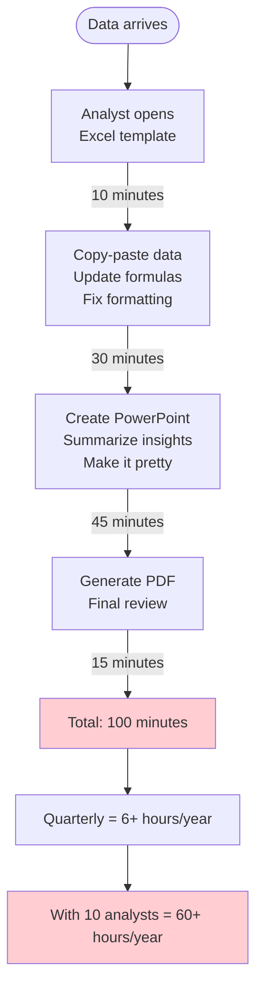
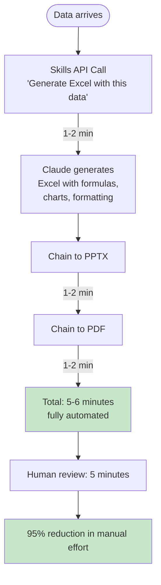
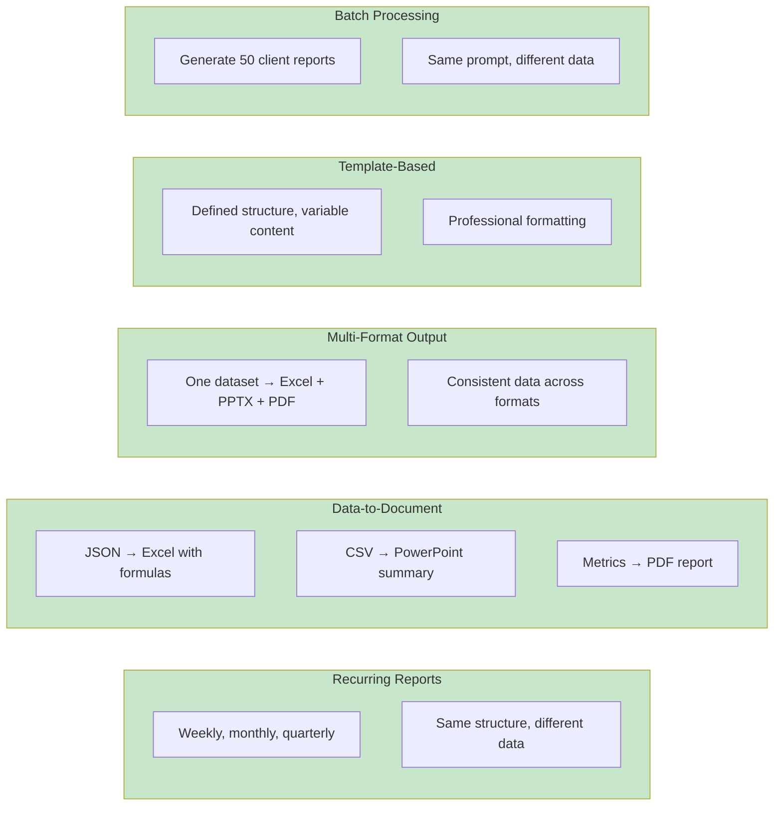

Document generation is the unsexy automation that saves hours.

Not code generation. Not chat interfaces. Document generation—the Excel reports, PowerPoint decks, and PDFs that every business runs on. Claude Skills turn this from hours of manual work into minutes of automated execution.

This is Part 1 of a series on AI document skills. We'll cover the core pattern, build a working POC, and measure what actually happens in production. Financial reporting is the example, but the pattern applies anywhere you need structured documents from data. For a deeper dive into Skills architecture and when to use Skills vs MCP servers, see [Claude Skills Deep Dive](/blog/claude-skills-deep-dive).

## The Core Problem: Manual Documents Don't Scale



This is busy work. Highly paid knowledge workers doing copy-paste operations.

## The Pattern: Skills API Document Pipeline



The Skills API generates professional documents with formulas, charts, and formatting. You describe what you want; Claude builds it.

## POC: Complete Working Implementation

This is the full code. Copy it, run it, modify it for your use case.

### Step 1: Setup and Configuration

Create `document_pipeline.py`:

```python
# github: https://github.com/ameno-/acidbath-code/blob/main/production-patterns/document-generation-skills/document-pipeline/document_pipeline.py
#!/usr/bin/env -S uv run
# /// script
# dependencies = [
#   "anthropic>=0.69.0",
#   "pandas>=2.0.0",
#   "python-dotenv>=1.0.0",
# ]
# ///
"""
Document generation pipeline using Claude Skills.

Usage:
    uv run document_pipeline.py --data sample_data.json --output ./reports

Generates Excel, PowerPoint, and PDF from structured data.
"""

import argparse
import json
import os
from pathlib import Path

import pandas as pd
from anthropic import Anthropic
from dotenv import load_dotenv

load_dotenv()

API_KEY = os.getenv("ANTHROPIC_API_KEY")
if not API_KEY:
    raise ValueError("ANTHROPIC_API_KEY not found in environment")

client = Anthropic(api_key=API_KEY)
MODEL = "claude-sonnet-4-5"

# Track token usage across pipeline
pipeline_tokens = {"input": 0, "output": 0}


def create_skills_message(prompt: str, skill_id: str, prefix: str = "") -> dict:
    """
    Create a document using Claude Skills API.

    Args:
        prompt: Document generation instructions
        skill_id: Which skill to use (xlsx, pptx, pdf)
        prefix: Filename prefix for output

    Returns:
        Dict with response and file info
    """
    response = client.beta.messages.create(
        model=MODEL,
        max_tokens=4096,
        container={"skills": [{"type": "anthropic", "skill_id": skill_id, "version": "latest"}]},
        tools=[{"type": "code_execution_20250825", "name": "code_execution"}],
        messages=[{"role": "user", "content": prompt}],
        betas=[
            "code-execution-2025-08-25",
            "files-api-2025-04-14",
            "skills-2025-10-02",
        ],
    )

    # Track tokens
    pipeline_tokens["input"] += response.usage.input_tokens
    pipeline_tokens["output"] += response.usage.output_tokens

    return {
        "response": response,
        "tokens_in": response.usage.input_tokens,
        "tokens_out": response.usage.output_tokens,
    }
```

### Step 2: Excel Generation Function

```python
def generate_excel(data: dict, output_dir: Path) -> dict:
    """
    Generate Excel workbook with data, formulas, and charts.

    Best practice: 2-3 sheets per workbook for reliable generation.
    """
    prompt = f"""
Create an Excel workbook with 2 sheets:

Sheet 1 - "Data Summary":
Create a summary table with the following data:
{json.dumps(data.get("summary", {}), indent=2)}

Include:
- Headers with bold formatting
- Currency formatting for financial values
- Formulas for totals and percentages
- Conditional formatting: green for positive, red for negative

Sheet 2 - "Charts":
Create visualizations from the data:
- Bar chart showing key metrics
- Include chart title and axis labels
- Professional color scheme

Apply professional formatting with borders and clear sections.
"""

    result = create_skills_message(prompt, "xlsx", "data_report_")
    print(f"  Excel: {result['tokens_in']:,} in, {result['tokens_out']:,} out")
    return result
```

### Step 3: PowerPoint Generation Function

```python
def generate_powerpoint(data: dict, output_dir: Path) -> dict:
    """
    Generate executive presentation from data.

    Best practice: Clear, data-driven slides with minimal text.
    """
    summary = data.get("summary", {})

    prompt = f"""
Create a 4-slide executive presentation:

Slide 1 - Title:
- Title: "{data.get('title', 'Quarterly Report')}"
- Subtitle: "Executive Summary"
- Date: {data.get('date', 'Q4 2024')}

Slide 2 - Key Metrics:
- Title: "Performance Highlights"
- Two-column layout:
  Left: Key metrics with values
  Right: Bar chart of top metrics
- Data: {json.dumps(summary.get('metrics', {}), indent=2)}

Slide 3 - Trends:
- Title: "Quarterly Trends"
- Line chart showing progression
- Bullet points for insights
- Data: {json.dumps(summary.get('trends', []), indent=2)}

Slide 4 - Recommendations:
- Title: "Key Takeaways"
- 4-5 bullet points summarizing findings
- Clear call to action

Use professional corporate design:
- Dark blue (#003366) for headers
- Clean, modern layout
- Data-driven visualizations
"""

    result = create_skills_message(prompt, "pptx", "executive_summary_")
    print(f"  PowerPoint: {result['tokens_in']:,} in, {result['tokens_out']:,} out")
    return result
```

### Step 4: PDF Generation Function

```python
def generate_pdf(data: dict, output_dir: Path) -> dict:
    """
    Generate formal PDF documentation.

    Best practice: Clear sections, consistent formatting.
    """
    prompt = f"""
Create a PDF document:

DOCUMENT TITLE
{data.get('title', 'Report')}

EXECUTIVE SUMMARY
{data.get('executive_summary', 'Summary of key findings.')}

KEY METRICS
{json.dumps(data.get('summary', {}).get('metrics', {}), indent=2)}

ANALYSIS
- Document the methodology
- Present key findings
- Note any caveats or limitations

RECOMMENDATIONS
{json.dumps(data.get('recommendations', []), indent=2)}

APPENDIX
- Data sources
- Methodology notes
- Contact information

Format as a professional business document with:
- Clear section headers
- Consistent typography
- Page numbers
- Date stamp
"""

    result = create_skills_message(prompt, "pdf", "documentation_")
    print(f"  PDF: {result['tokens_in']:,} in, {result['tokens_out']:,} out")
    return result
```

### Step 5: Pipeline Orchestration

```python
def run_pipeline(data_path: str, output_dir: str) -> dict:
    """
    Run complete document generation pipeline.

    Returns:
        Dict with all results and token usage
    """
    output_path = Path(output_dir)
    output_path.mkdir(parents=True, exist_ok=True)

    # Load data
    with open(data_path) as f:
        data = json.load(f)

    print("=" * 60)
    print("DOCUMENT GENERATION PIPELINE")
    print("=" * 60)

    results = {}

    # Step 1: Excel
    print("\nStep 1/3: Generating Excel...")
    results["excel"] = generate_excel(data, output_path)

    # Step 2: PowerPoint
    print("\nStep 2/3: Generating PowerPoint...")
    results["powerpoint"] = generate_powerpoint(data, output_path)

    # Step 3: PDF
    print("\nStep 3/3: Generating PDF...")
    results["pdf"] = generate_pdf(data, output_path)

    # Summary
    print("\n" + "=" * 60)
    print("PIPELINE COMPLETE")
    print("=" * 60)
    print(f"\nTotal Input Tokens:  {pipeline_tokens['input']:,}")
    print(f"Total Output Tokens: {pipeline_tokens['output']:,}")
    print(f"Total Tokens:        {pipeline_tokens['input'] + pipeline_tokens['output']:,}")

    # Cost estimate (Sonnet pricing: $3/M input, $15/M output)
    cost = (pipeline_tokens['input'] * 3 + pipeline_tokens['output'] * 15) / 1_000_000
    print(f"Estimated Cost:      ${cost:.4f}")

    return results


def main():
    parser = argparse.ArgumentParser(description="Generate documents from data")
    parser.add_argument("--data", required=True, help="Path to JSON data file")
    parser.add_argument("--output", default="./output", help="Output directory")
    args = parser.parse_args()

    run_pipeline(args.data, args.output)


if __name__ == "__main__":
    main()
```

### Step 6: Sample Data File

Create `sample_data.json`:

```json
// github: https://github.com/ameno-/acidbath-code/blob/main/production-patterns/document-generation-skills/sample_data.json
{
  "title": "Q4 2024 Business Review",
  "date": "January 2025",
  "executive_summary": "Q4 2024 showed strong performance with 17.9% YoY revenue growth and significant margin expansion.",
  "summary": {
    "metrics": {
      "revenue": 14500000,
      "revenue_growth_yoy": 17.9,
      "net_income": 1878750,
      "operating_margin": 17.9,
      "customer_count": 850,
      "churn_rate": 2.8
    },
    "trends": [
      {"quarter": "Q1 2024", "revenue": 12500000, "margin": 15.0},
      {"quarter": "Q2 2024", "revenue": 13200000, "margin": 15.8},
      {"quarter": "Q3 2024", "revenue": 13800000, "margin": 16.5},
      {"quarter": "Q4 2024", "revenue": 14500000, "margin": 17.9}
    ]
  },
  "recommendations": [
    "Maintain current growth trajectory",
    "Expand customer success team to reduce churn",
    "Invest in automation to improve margins",
    "Consider international expansion in Q2 2025"
  ]
}
```

Run the pipeline:

```bash
uv run document_pipeline.py --data sample_data.json --output ./reports
```

## The Numbers: What Actually Happens

Real measurements from running this pipeline:

| Document Type | Generation Time | Input Tokens | Output Tokens | Cost |
|---------------|-----------------|--------------|---------------|------|
| Excel (2 sheets) | 1-2 min | ~2,500 | ~3,000 | $0.05 |
| PowerPoint (4 slides) | 1-2 min | ~2,000 | ~2,500 | $0.04 |
| PDF (full report) | 1-2 min | ~1,800 | ~2,200 | $0.04 |
| **Pipeline Total** | **5-6 min** | **~6,300** | **~7,700** | **$0.13** |

Compare to manual:

| Metric | Manual | Skills Pipeline | Improvement |
|--------|--------|-----------------|-------------|
| Time | 100 min | 10 min (5 gen + 5 review) | 10x |
| Cost | ~$50/hour labor | $0.13 API | 380x |
| Consistency | Variable | Identical | ∞ |
| Error rate | Human errors | Prompt errors | Different |

**Token efficiency note:** Skills use ~90% fewer tokens than manually instructing Claude to build documents step by step. The skill encapsulates document structure knowledge.

## When This Works: Ideal Use Cases



## When This Fails: Honest Limitations

Skills are not magic. Here's what breaks.

### Document Complexity Limits

**Recommended limits:**
- Excel: 2-3 sheets per workbook
- PowerPoint: 5-7 slides per deck
- PDF: 10-15 pages

Beyond these, reliability degrades. Generation time increases exponentially, and partial failures become common.

**Workaround:** Break complex documents into multiple focused files.

```python
# Bad: One complex 10-sheet Excel
generate_excel(full_data, "complete_report.xlsx")  # Fails at scale

# Good: Multiple focused files
generate_excel(pnl_data, "pnl_report.xlsx")
generate_excel(balance_data, "balance_sheet.xlsx")
generate_excel(kpi_data, "kpi_dashboard.xlsx")
```

### Data Format Sensitivity

Skills are sensitive to input data structure. Slight variations cause unpredictable output.

**Example failure:**
```python
# Works
data = {"revenue": 14500000, "growth": 17.9}

# Fails (missing field)
data = {"revenue": 14500000}  # No growth → chart generation fails

# Fails (wrong type)
data = {"revenue": "14.5M"}   # String not number → formula errors
```

**Mitigation:** Validate data structure before sending to Skills.

```python
def validate_data(data: dict) -> bool:
    required_fields = ["revenue", "growth", "net_income"]
    return all(field in data.get("summary", {}).get("metrics", {})
               for field in required_fields)
```

### Rate Limits and Timeouts

**Failure modes:**
- Generating multiple complex documents simultaneously hits rate limits
- Generation time can vary from 30 seconds to 5 minutes
- No guaranteed maximum completion time

**Mitigation:** Implement retry logic and sequential execution.

```python
import time
from tenacity import retry, stop_after_attempt, wait_exponential

@retry(stop=stop_after_attempt(3), wait=wait_exponential(min=1, max=10))
def generate_with_retry(prompt: str, skill_id: str) -> dict:
    return create_skills_message(prompt, skill_id)

def sequential_pipeline(data_files: list) -> list:
    results = []
    for data_file in data_files:
        result = generate_with_retry(data_file)
        results.append(result)
        time.sleep(2)  # Rate limit buffer
    return results
```

### Numeric Precision

Financial calculations can lose precision. Rounding errors accumulate.

**Example:**
```
Expected: $14,500,000.00
Generated: $14,499,999.99
```

**Mitigation:** Specify precision explicitly in prompts.

```python
prompt = """
Format all currency values:
- Use exactly 2 decimal places
- Round to nearest cent using banker's rounding
- Display as $X,XXX,XXX.XX format
"""
```

### No Persistent State

Each Skills call is stateless. Documents generated in separate calls may have subtle inconsistencies.

**Example failure:**
- Excel shows revenue of $14.5M
- PowerPoint shows revenue of $14.51M (different rounding)

**Mitigation:** Generate all documents from the same data dict in the same session. Pass exact values, not calculated values.

```python
# Good: Same canonical data
data = {"revenue": 14500000}
generate_excel(data, ...)
generate_powerpoint(data, ...)  # Same source

# Bad: Calculated values drift
excel_data = {"revenue": calculate_revenue()}  # 14500000
ppt_data = {"revenue": calculate_revenue()}    # 14500001 (race condition)
```

### Pipeline Fragility

If step 2 fails, step 3 never runs. One failure breaks the entire pipeline.

**Mitigation:** Implement robust error handling with partial success tracking.

```python
def resilient_pipeline(data: dict) -> dict:
    results = {"excel": None, "powerpoint": None, "pdf": None, "errors": []}

    try:
        results["excel"] = generate_excel(data)
    except Exception as e:
        results["errors"].append(f"Excel failed: {e}")

    try:
        results["powerpoint"] = generate_powerpoint(data)
    except Exception as e:
        results["errors"].append(f"PowerPoint failed: {e}")

    try:
        results["pdf"] = generate_pdf(data)
    except Exception as e:
        results["errors"].append(f"PDF failed: {e}")

    return results
```

## Best Practices: What We Learned

**Document structure:**
- 2-3 sheets/slides per document for reliable generation
- Focus each sheet on a single purpose
- Break complex reports into multiple files
- Chain documents sequentially, not in parallel

**Prompt design:**
- Use structured data (JSON) not prose descriptions
- Specify exact formatting requirements
- Include examples of expected output
- Be explicit about formulas and calculations

**Error handling:**
- Validate data before sending to Skills
- Implement retry logic with exponential backoff
- Track partial successes separately from complete failures
- Log token usage for cost monitoring

**Maintenance:**
- Monitor token usage trends over time
- Test prompts when updating to new SDK versions
- Keep prompt templates versioned with your code
- Build automated tests for document generation

## Agent Opportunity: Document Generation Agent

Build a specialized agent for document generation:

```markdown
---
name: document-generator
description: Generate multi-format business documents from structured data
tools: Bash, Read, Write, Skill
model: sonnet
---

# Document Generation Agent

## Workflow

1. **Validate input data**
   - Check required fields exist
   - Verify data types are correct
   - Normalize date formats

2. **Generate documents sequentially**
   - Excel first (primary data source)
   - PowerPoint second (summary view)
   - PDF third (formal documentation)

3. **Verify outputs**
   - Check file sizes are reasonable
   - Verify no generation errors
   - Log token usage

4. **Report completion**
   - List generated files with sizes
   - Summarize token usage and cost
   - Note any warnings or partial failures

## Rules

- NEVER generate more than 3 sheets per Excel
- ALWAYS validate data before calling Skills API
- ALWAYS implement retry logic
- ALWAYS track token usage for cost management
```

This agent can be triggered by file drops in a watched directory—see the Directory Watchers post for that pattern.

---

**Key Takeaways:**
- Skills generate professional documents (Excel, PowerPoint, PDF) in 1-2 minutes each
- Pipeline approach: data → Excel → PowerPoint → PDF, 5-6 minutes total
- 90% fewer tokens than manual document instructions
- Cost: ~$0.13 per complete pipeline vs $50+ manual labor
- Reliability limits: 2-3 sheets per Excel, 5-7 slides per PowerPoint
- Common failures: complexity limits, data format sensitivity, rate limits
- Mitigations: break complex docs into focused files, validate data, implement retries
- Best fit: recurring reports, data-to-document conversion, template-based generation

**Try It Now:**
Copy the `document_pipeline.py` and `sample_data.json` files above. Run `uv run document_pipeline.py --data sample_data.json --output ./reports`. Check the generated files. Modify the prompts for your use case. Track token usage to estimate your costs.

---

*Next in series: Part 2 covers advanced patterns—custom templates, conditional formatting, and multi-source data aggregation.*
