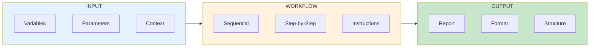
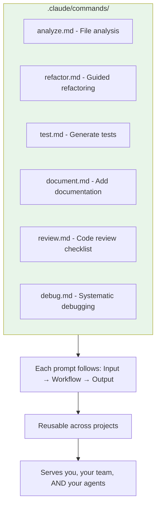
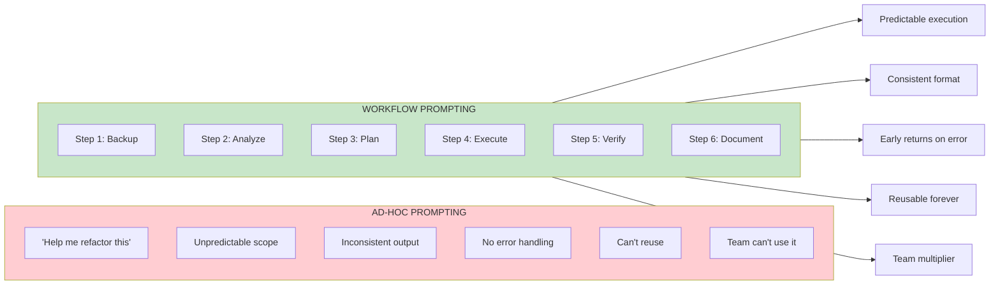

The workflow section is the most important thing you'll write in any agentic prompt.

Not the metadata. Not the variables. Not the fancy control flow. The workflow—your step-by-step play for what the agent should do—drives 90% of the value you'll capture from AI-assisted engineering.

Most developers write prompts like they're having a conversation. Then they wonder why their agents produce inconsistent results, skip steps, and require constant babysitting. The difference between prompts that work and prompts that require hand-holding is the workflow section.

This post shows you how to build workflow prompts that actually work, with templates you can use today. It also covers the failure modes you'll encounter and how to calculate whether a workflow prompt is worth writing.

## The Core Pattern: Input → Workflow → Output

Every effective agentic prompt follows this three-step structure:



The workflow section is where your agent's actual work happens. It's rated S-tier usefulness with C-tier difficulty—the most valuable component is also the easiest to execute well.

## POC: A Working Workflow Prompt

Here's a complete, production-ready workflow prompt you can use as a Claude Code command:

```markdown
---
description: Analyze a file and create implementation plan
allowed-tools: Read, Glob, Grep, Write
argument-hint: <file_path>
---

# File Analysis and Planning Agent

## Purpose
Analyze the provided file and create a detailed implementation plan for improvements.

## Variables
- **target_file**: $ARGUMENTS (the file to analyze)
- **output_dir**: ./specs

## Workflow

1. **Read the target file**
   - Load the complete contents of {{target_file}}
   - Note the file type, structure, and purpose

2. **Analyze the codebase context**
   - Use Glob to find related files (same directory, similar names)
   - Use Grep to find references to functions/classes in this file
   - Identify dependencies and dependents

3. **Identify improvement opportunities**
   - List potential refactoring targets
   - Note any code smells or anti-patterns
   - Consider performance optimizations
   - Check for missing error handling

4. **Create implementation plan**
   - For each improvement, specify:
     - What to change
     - Why it matters
     - Files affected
     - Risk level (low/medium/high)

5. **Write the plan to file**
   - Save to {{output_dir}}/{{filename}}-plan.md
   - Include timestamp and file hash for tracking

## Output Format
file_analyzed: {{target_file}}
timestamp: {{current_time}}
improvements:
  - id: 1
    type: refactor|performance|error-handling|cleanup
    description: "What to change"
    rationale: "Why it matters"
    files_affected: [list]
    risk: low|medium|high
    effort: small|medium|large

## Early Returns
- If {{target_file}} doesn't exist, stop and report error
- If file is binary or unreadable, stop and explain
- If no improvements found, report "file looks good" with reasoning
```

Save this as `.claude/commands/analyze.md` and run with `/analyze src/main.py`.

## The Workflow Section Deep Dive

What makes workflow sections powerful:

**Sequential clarity** - Numbered steps eliminate ambiguity. The agent knows exactly what order to execute.

```markdown
## Workflow

1. Read the config file
2. Parse the JSON structure
3. Validate required fields exist
4. Transform data to new format
5. Write output file
```

**Nested detail** - Add specifics under each step without breaking the sequence:

```markdown
## Workflow

1. **Gather requirements**
   - Read the user's request carefully
   - Identify explicit requirements
   - Note implicit assumptions
   - List questions if anything is unclear

2. **Research existing code**
   - Search for similar implementations
   - Check for utility functions that could help
   - Review relevant documentation
```

**Conditional branches** - Handle different scenarios:

```markdown
## Workflow

1. Check if package.json exists
2. **If exists:**
   - Parse dependencies
   - Check for outdated packages
   - Generate update recommendations
3. **If not exists:**
   - Stop and inform user this isn't a Node project
```

## When Workflow Prompts Fail (Know This Before You Invest the Time)

Workflow prompts are powerful, but they're not universal. Here are the failure modes I've hit in production—each one a lesson that cost real debugging time:

**Overly complex tasks requiring human judgment mid-execution**

I tried building a workflow prompt for database migration planning. The prompt could analyze schema differences and generate SQL, but it couldn't decide which migrations were safe to auto-apply versus which needed DBA review. The decision tree had too many branches: data volume considerations, cross-region timing, rollback complexity, customer impact windows.

The workflow kept requesting human input at steps 3, 5, 7, and 9 of a 12-step process. At that point, you're better off doing it interactively. Workflow prompts excel when the decision points are clear and the execution path is deterministic.

**Rule of thumb**: If your workflow has more than 2 "stop and ask the user" points, it's probably not a good fit.

**Ambiguous requirements that can't be specified upfront**

"Generate a blog post outline for our next marketing campaign" sounds like a good workflow candidate. It's not. The requirements shift based on the output. You see the first draft and realize you want a different tone. The second section needs more technical depth. The third needs less.

I wrote a 300-line workflow prompt for content generation that included 15 different quality checks and formatting rules. The agent followed it perfectly and produced consistently mediocre output. The problem wasn't execution—it was that I couldn't articulate "make it interesting" in workflow steps.

Interactive prompting lets you course-correct in real-time. Workflow prompts lock in your assumptions upfront.

**Tasks requiring real-time adaptation**

Debugging sessions are the classic example. You can't write a workflow for "figure out why the auth service is returning 500 errors" because each finding changes what you need to check next. Step 1 might be "check logs," but what you find in the logs determines whether step 2 is "inspect database connections" or "review API gateway config" or "check Redis cache status."

Workflow prompts assume a static execution path. Debugging requires dynamic branching based on runtime discoveries.

**When the overhead of writing the prompt exceeds the task time**

This is the trap I see most often. Someone spends 2 hours writing a workflow prompt for a task that takes 30 minutes to do manually. They run it once, it works great, and then they never use it again.

If you're not going to run a workflow at least 5 times, don't build it. Do it manually or use interactive prompting.

**Edge case: Workflows that seem simple but have hidden complexity**

"Rename this function across the codebase" sounds trivial. Write a workflow prompt: search for all instances, replace them, update imports, done. Except the function is called `get()` and your codebase has 47 different `get()` functions. Or it's used in generated code. Or it's referenced in documentation strings that need different formatting. Or it's in test mocks that need manual review.

I've seen 10-step workflow prompts fail at step 8 because an edge case no one anticipated appeared. The agent either halted with an error or plowed ahead and broke things. Neither outcome is great when you're at 80% completion.

For tasks with hidden complexity, start with interactive prompting. Once you've hit the edge cases manually, then codify the workflow.

## Measuring Workflow ROI

The question you should ask before writing any workflow prompt: "Will this pay for itself?"

**Time to write workflow prompt vs time saved**

A workflow prompt takes between 20 minutes (simple, templated) and 3 hours (complex, multi-step). Most fall in the 45-60 minute range if you're building from scratch.

Task execution time varies, but here's the break-even math:

```
Break-even uses = (Time to write prompt) / (Time saved per use)
```

Example 1: Code review workflow
- Time to write: 60 minutes
- Manual review time: 20 minutes
- Time with workflow: 5 minutes (you review the agent's output)
- Time saved per use: 15 minutes
- Break-even: 60 / 15 = 4 uses

If you review code 4+ times, the workflow prompt pays off.

Example 2: API endpoint scaffolding
- Time to write: 90 minutes (includes error handling, validation, tests)
- Manual scaffold time: 40 minutes
- Time with workflow: 8 minutes (review and tweak)
- Time saved per use: 32 minutes
- Break-even: 90 / 32 = 2.8 uses (round to 3)

If you build 3+ similar endpoints, the workflow prompt pays off.

**The multiplier effect**

This calculation assumes only you use the workflow. If your team uses it, divide break-even by team size.

A 30-minute workflow prompt on a 5-person team needs to save each person just 6 minutes once to break even. That's a no-brainer for common tasks like "add API endpoint," "generate test file," or "create component boilerplate."

**The hidden cost: maintenance**

Workflow prompts break when your codebase evolves. Your folder structure changes. Your testing framework updates. Your naming conventions shift.

I maintain about 40 workflow prompts for client projects. Roughly 10% break each quarter and need updates. Budget 15-30 minutes per quarter per active workflow for maintenance.

If a workflow saves you 2 hours per month but costs 30 minutes per quarter to maintain, the net ROI is still massive: 24 hours saved vs 2 hours maintenance over a year.

**When to skip the ROI calculation**

Some workflows are worth it regardless of break-even math:
- Team onboarding tasks (new hires benefit disproportionately)
- Critical path operations where consistency matters more than speed
- Compliance tasks that require documented, repeatable processes

If the task is high-stakes or high-variance, the value of predictability can exceed the value of time saved.

## Agent Opportunity: Build a Prompt Library

Here's where you can multiply your impact:



## Why Workflows Beat Ad-Hoc Prompting



The workflow prompt transforms a vague request into an executable engineering plan. One workflow prompt executing for an hour can generate work that would take you 20 hours.

## Building Your First Workflow Prompt (Start Today)

Start with your most common task. The one you do every day. The one where you think "I should automate this."

1. Write out the steps you take manually
2. Convert each step to a numbered instruction
3. Add variables for the parts that change
4. Add early returns for failure cases
5. Specify the output format you want

Test it. Iterate. Add to your library.

**The prompt is the new fundamental unit of engineering.** The workflow section is where that engineering actually happens. One good workflow prompt doesn't just save time—it compounds across every use, every team member, every project.

Stop typing the same instructions. Start building reusable workflows.

---

**Key Takeaways:**
- Workflow sections are S-tier value, C-tier difficulty
- Input → Workflow → Output is the universal pattern
- Numbered steps create predictable execution
- Early returns handle failure cases cleanly
- Workflows fail on complex judgment calls, ambiguous requirements, and real-time adaptation tasks
- Break-even calculation: (Time to write) / (Time saved per use) = minimum uses needed
- A 30-minute workflow prompt pays off after 3 uses of a 15-minute task
- Build a library of reusable workflow prompts for maximum team ROI
- One good workflow prompt = 20+ hours of work

**Try It Now (20 Minutes to First Workflow):**
Copy the analyze.md template above, save to `.claude/commands/analyze.md`, and run `/analyze` on any file in your codebase. Time how long it takes to write the prompt and how long the analysis takes to run. Calculate your break-even point for the next time you need to analyze a file.

If you use it 4 times, you've already recouped your investment. Everything after that is pure productivity gain. Share it with your team and multiply the returns.
