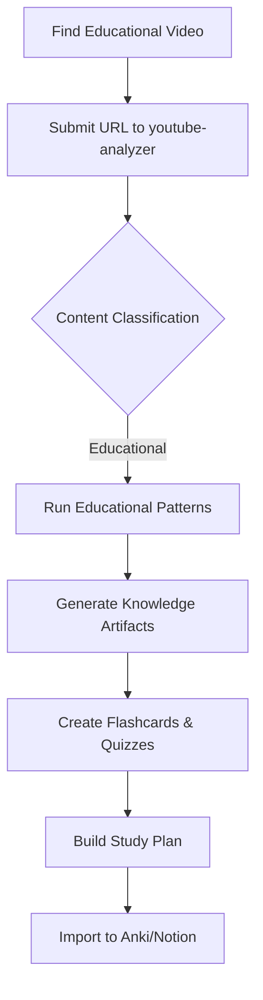
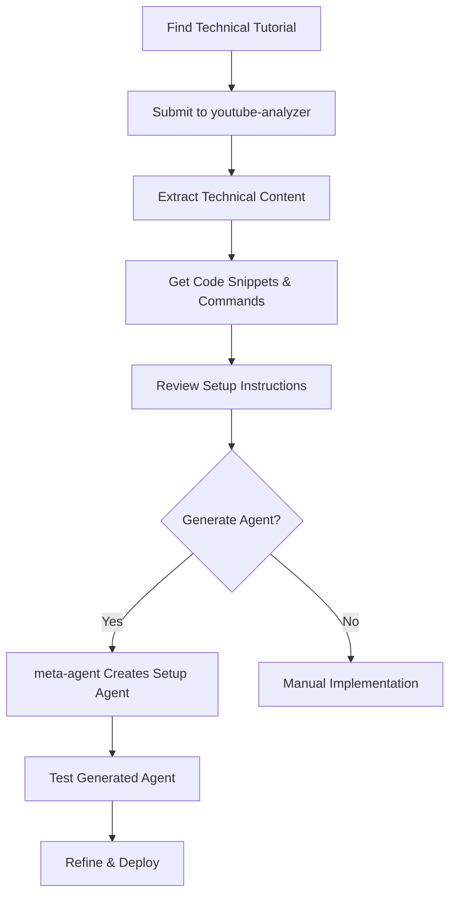
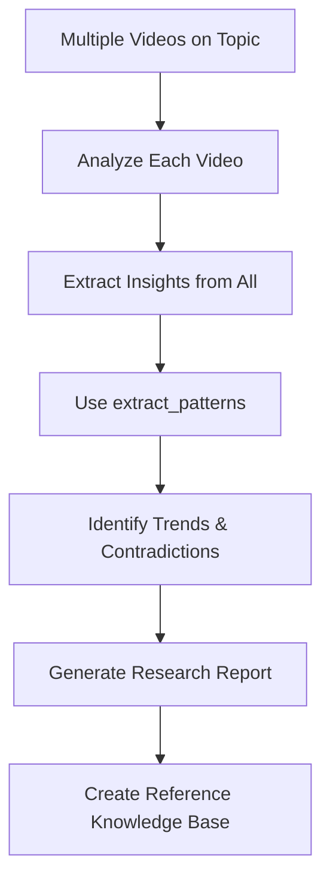
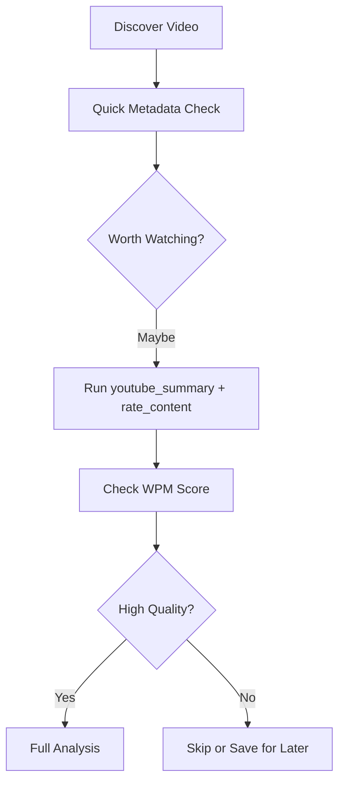

# YouTube Analysis → Agent/Hook Generation System

**Complete Documentation**

## Table of Contents

1. [System Overview](#system-overview)
2. [Architecture](#architecture)
3. [Components](#components)
4. [Installation & Setup](#installation--setup)
5. [Usage Guide](#usage-guide)
6. [Workflows](#workflows)
7. [Testing](#testing)
8. [Customization](#customization)
9. [Troubleshooting](#troubleshooting)
10. [Examples](#examples)

---

## System Overview

This system provides comprehensive YouTube video analysis with automatic agent and hook generation capabilities. It combines Fabric CLI patterns, Claude Code agents, and event-driven hooks to create a self-improving automation platform.

### Key Capabilities

- **Multi-Pattern Analysis**: Runs 8+ fabric patterns to extract wisdom, insights, technical content, and educational value
- **Content Classification**: Automatically detects technical, educational, or general content
- **Knowledge Artifacts**: Generates flashcards, quizzes, diagrams, and study materials
- **Automation Discovery**: Identifies workflow patterns that can be automated
- **Agent Generation**: Creates new Claude Code agents from video content
- **Hook Creation**: Generates event-driven automation scripts
- **Semi-Automatic Workflow**: Detects YouTube URLs and suggests analysis without forcing it

### Design Philosophy

- **User Autonomy**: Suggest, don't force - semi-automatic detection
- **Comprehensive Analysis**: Multi-pattern approach for deep insights
- **Self-Improving**: Meta-agent generates new capabilities from content
- **Organized Output**: Structured directory hierarchy for easy navigation
- **Actionable Results**: Focus on practical recommendations and next steps

---

## Architecture

```
┌─────────────────┐
│  User Submits   │
│  YouTube URL    │
└────────┬────────┘
         │
         ▼
┌─────────────────────────────┐
│  user_prompt_submit.py Hook │ (Optional: --detect-youtube flag)
│  - Detects YouTube URL       │
│  - Suggests youtube-analyzer │
└────────┬────────────────────┘
         │
         ▼
┌──────────────────────────────────┐
│  youtube-analyzer Agent          │
│  ┌────────────────────────────┐  │
│  │ 1. Extract Metadata        │  │
│  │ 2. Get Transcript          │  │
│  │ 3. Classify Content        │  │
│  │ 4. Run Pattern Suite       │  │
│  │ 5. Aggregate Results       │  │
│  │ 6. Generate Audio Summary  │  │
│  └────────────────────────────┘  │
└────────┬─────────────────────────┘
         │
         ├─────────────┬─────────────┐
         │             │             │
         ▼             ▼             ▼
    ┌────────┐  ┌────────────┐  ┌─────────────┐
    │ Core   │  │ Technical  │  │ Educational │
    │Patterns│  │  Patterns  │  │  Patterns   │
    └───┬────┘  └─────┬──────┘  └──────┬──────┘
        │             │                 │
        └─────────────┴─────────────────┘
                      │
                      ▼
         ┌─────────────────────────┐
         │  Aggregated Report      │
         │  + Pattern Outputs      │
         │  + Opportunities File   │
         └────────┬────────────────┘
                  │
                  ▼
         ┌─────────────────────┐
         │  meta-agent         │ (Optional)
         │  - Reviews opps     │
         │  - Generates agents │
         │  - Creates hooks    │
         │  - Makes patterns   │
         └────────┬────────────┘
                  │
                  ▼
    ┌──────────────────────────────┐
    │  Generated Artifacts         │
    │  - Agents (.md)              │
    │  - Hooks (.py)               │
    │  - Patterns (system.md)      │
    │  - Knowledge (flashcards)    │
    └──────────────────────────────┘
```

### Data Flow

1. **Input**: YouTube URL (any format)
2. **Detection**: Hook identifies URL and suggests analyzer
3. **Extraction**: yt-dlp pulls metadata + transcript
4. **Classification**: Content type determines pattern suite
5. **Analysis**: Multiple patterns run in parallel/sequence
6. **Aggregation**: Results combined into comprehensive report
7. **Opportunity ID**: extract_agent_opportunities finds automation potential
8. **Generation**: meta-agent creates agents/hooks/patterns
9. **Integration**: Artifacts saved and ready to use

---

## Components

### 1. Fabric Patterns

Location: `/Users/ameno/.config/fabric/patterns/`

#### Custom Patterns Created

**extract_youtube_metadata**
- Extracts video info, engagement metrics, content classification
- Provides quality indicators and watch priority
- Output: Structured metadata analysis

**extract_technical_content**
- Identifies code snippets, commands, tools, frameworks
- Extracts configuration files and dependencies
- Maps workflow steps and automation opportunities
- Output: Technical reference with code examples

**extract_agent_opportunities**
- Analyzes workflow patterns for automation potential
- Suggests agent configurations with frontmatter
- Identifies hook triggers and custom pattern needs
- Prioritizes by impact and implementation complexity
- Output: Actionable automation roadmap

**extract_educational_value**
- Identifies learning objectives and prerequisites
- Assesses skill level requirements
- Analyzes teaching methodology
- Provides learning path recommendations
- Output: Educational assessment and study plan

**create_knowledge_artifacts**
- Generates flashcards (Anki-compatible)
- Creates quizzes (multiple choice, true/false, short answer)
- Designs concept maps and process diagrams (Mermaid)
- Builds cheat sheets and quick references
- Output: Ready-to-use study materials

#### Existing Patterns Used

- `youtube_summary` - Video summary with timestamps
- `extract_wisdom` - Comprehensive knowledge extraction
- `extract_insights` - Key takeaways
- `extract_recommendations` - Actionable items
- `get_wow_per_minute` - Content quality scoring
- `rate_content` - Content classification and prioritization

### 2. Claude Code Agents

Location: `/Users/ameno/.claude/agents/`

#### youtube-analyzer.md

**Purpose**: Orchestrates comprehensive multi-pattern YouTube video analysis

**Tools**: Bash, Read, Write, mcp__filesystem__write_file, mcp__filesystem__create_directory

**Workflow**:
1. Validates input and extracts video ID
2. Creates organized output directory structure
3. Extracts metadata and transcript via yt-dlp
4. Classifies content type (technical/educational/general)
5. Runs appropriate pattern suite
6. Aggregates results into comprehensive report
7. Optionally generates audio summary via TTS
8. Presents results with actionable next steps

**Key Features**:
- Intelligent pattern selection based on content
- Parallel execution where possible
- Graceful error handling
- Structured output organization
- Integration suggestions for meta-agent

#### meta-agent.md

**Purpose**: Generates new Claude Code agents, hooks, and fabric patterns from automation opportunities

**Tools**: Bash, Read, Write, mcp__filesystem__write_file, mcp__filesystem__create_directory, mcp__filesystem__read_text_file

**Workflow**:
1. Reads extract_agent_opportunities output
2. Validates each opportunity (purpose, tools, value)
3. Generates properly formatted agent .md files
4. Creates functional hook .py scripts
5. Designs custom fabric patterns
6. Validates all configurations
7. Saves to appropriate directories
8. Provides integration and testing instructions

**Key Features**:
- Quality over quantity - only generates valuable artifacts
- Follows Claude Code conventions exactly
- Includes comprehensive documentation
- Provides usage examples
- Validates before saving

### 3. Enhanced Hook

Location: `/Users/ameno/.claude/hooks/user_prompt_submit.py`

#### YouTube URL Detection

**New Flag**: `--detect-youtube`

**Functionality**:
- Detects YouTube URLs in multiple formats via regex
- Extracts video ID and constructs standardized URL
- Injects context reminder suggesting youtube-analyzer
- Works in semi-automatic mode (suggests, doesn't force)

**Supported URL Formats**:
- `https://youtube.com/watch?v=VIDEO_ID`
- `https://youtu.be/VIDEO_ID`
- `https://youtube.com/embed/VIDEO_ID`
- `https://youtube.com/v/VIDEO_ID`

**Integration**: Add `--detect-youtube` flag to hook configuration in settings.json

---

## Installation & Setup

### Prerequisites

- Claude Code installed and configured
- Fabric CLI installed (`/Users/ameno/.local/bin/fabric`)
- yt-dlp installed and updated
- Python 3.11+ with uv
- Optional: ElevenLabs or OpenAI API key for TTS

### Step 1: Verify Fabric Patterns

Check that all custom patterns are installed:

```bash
fabric --listpatterns | grep -E "(extract_youtube_metadata|extract_technical_content|extract_agent_opportunities|extract_educational_value|create_knowledge_artifacts)"
```

Expected output:
```
extract_agent_opportunities
extract_educational_value
extract_technical_content
extract_youtube_metadata
create_knowledge_artifacts
```

### Step 2: Verify Agents

Check that agents are available:

```bash
ls -la ~/.claude/agents/ | grep -E "(youtube-analyzer|meta-agent)"
```

Expected output:
```
youtube-analyzer.md
meta-agent.md
```

### Step 3: Enable YouTube URL Detection (Optional)

Edit `/Users/ameno/.claude/settings.json`:

```json
{
  "hooks": {
    "UserPromptSubmit": [{
      "hooks": [{
        "type": "command",
        "command": "uv run ~/.claude/hooks/user_prompt_submit.py --log-only --store-last-prompt --name-agent --detect-youtube"
      }]
    }]
  }
}
```

### Step 4: Create Output Directory

```bash
mkdir -p /Users/ameno/dev/umbra-dev/technical-research/output/youtube-analysis
```

### Step 5: Test Installation

```bash
# Test YouTube URL detection
echo '{"session_id": "test", "prompt": "Check out https://youtube.com/watch?v=dQw4w9WgXcQ"}' | \
  uv run ~/.claude/hooks/user_prompt_submit.py --detect-youtube

# Test fabric pattern
echo "Sample video transcript" | fabric --pattern extract_youtube_metadata
```

---

## Usage Guide

### Basic Workflow

#### 1. Analyze a YouTube Video

**Option A: Direct Agent Invocation**

```
User: Use youtube-analyzer agent with https://youtube.com/watch?v=VIDEO_ID
```

**Option B: Let Hook Suggest** (if `--detect-youtube` enabled)

```
User: Analyze this video: https://youtube.com/watch?v=VIDEO_ID

System: YouTube video detected. Consider using youtube-analyzer agent.

User: Yes, analyze it.
```

#### 2. Review Analysis Results

The agent will output a summary like:

```
✅ Analysis Complete: [Video Title]

📊 Quality Score: 8/10 | Priority: High
⏱️  Duration: 00:15:30 | Content Type: Technical

📁 Full Report: /output/youtube-analysis/VIDEO_ID/aggregated-report.md

🎯 Top 3 Insights:
1. [Insight from video]
2. [Insight from video]
3. [Insight from video]

🔧 Automation Opportunities Found: 3
  - [Agent opportunity]
  - [Hook opportunity]
```

#### 3. Access Detailed Reports

```bash
# Main aggregated report
cat /output/youtube-analysis/VIDEO_ID/aggregated-report.md

# Specific pattern outputs
cat /output/youtube-analysis/VIDEO_ID/patterns/extract_insights.md
cat /output/youtube-analysis/VIDEO_ID/patterns/extract_technical_content.md

# Automation opportunities
cat /output/youtube-analysis/VIDEO_ID/patterns/extract_agent_opportunities.md
```

#### 4. Generate Artifacts (Optional)

If automation opportunities were identified:

```
User: Use meta-agent with /output/youtube-analysis/VIDEO_ID/patterns/extract_agent_opportunities.md
```

The meta-agent will:
1. Review opportunities
2. Generate agent configurations
3. Create hook scripts
4. Design custom patterns
5. Save artifacts with installation instructions

### Advanced Workflows

#### Analyze Multiple Videos

```
User: I have 5 videos to analyze:
1. [URL 1]
2. [URL 2]
3. [URL 3]
4. [URL 4]
5. [URL 5]

Please analyze each and create a comparative report.
```

#### Custom Pattern Selection

```
User: Analyze [URL] but only run:
- youtube_summary
- extract_insights
- extract_technical_content

Skip the knowledge artifacts.
```

#### Chain to Other Workflows

```
User: Analyze [URL], then:
1. Extract all code snippets
2. Create a new agent that implements the workflow
3. Generate tests for the implementation
```

---

## Workflows

### Workflow 1: Learning from Educational Videos



**Steps**:
1. User finds educational video (course, lecture, tutorial)
2. Submits to youtube-analyzer agent
3. Agent detects educational content
4. Runs: extract_educational_value + create_knowledge_artifacts
5. Generates flashcards, quizzes, diagrams
6. User imports to Anki or study platform
7. User follows spaced repetition schedule

### Workflow 2: Technical Implementation from Tutorial



**Steps**:
1. User finds coding/tech tutorial
2. youtube-analyzer extracts all technical content
3. Pattern identifies: languages, tools, commands, workflows
4. extract_agent_opportunities suggests automation
5. meta-agent creates "project-setup" agent
6. User tests and deploys agent
7. Future projects use generated agent for setup

### Workflow 3: Research & Knowledge Synthesis



**Steps**:
1. User collects 5-10 videos on same topic
2. Analyzes each with youtube-analyzer
3. Aggregates all insights
4. Runs extract_patterns to identify themes
5. Generates comparative research report
6. Creates consolidated knowledge base
7. Exports to Obsidian/Notion/Roam

### Workflow 4: Content Curation & Prioritization



**Steps**:
1. User discovers video in feed
2. Runs quick metadata + rate_content pattern
3. Checks get_wow_per_minute score
4. If high quality (>7/10): full analysis
5. If medium (4-7/10): save for later
6. If low (<4/10): skip
7. Builds curated watching list

---

## Testing

### Test Plan

We'll test the system with three different video types:

1. **Technical/Coding** - MCP alternatives video
2. **Educational** - Programming lecture/tutorial
3. **General Knowledge** - Interesting topic video

### Test 1: Technical Video

**Video**: The MCP alternatives video we already summarized
**URL**: `https://youtube.com/watch?v=OIKTsVjTVJE`

**Expected**:
- Content classified as "Technical"
- extract_technical_content runs
- Identifies CLI, scripts, skills approaches
- extract_agent_opportunities suggests related agents
- No educational pattern runs

**Test Commands**:
```bash
# Test youtube_summary pattern
fabric -y "https://youtube.com/watch?v=OIKTsVjTVJE" --pattern youtube_summary

# Test custom metadata pattern
fabric -y "https://youtube.com/watch?v=OIKTsVjTVJE" --pattern extract_youtube_metadata

# Test technical content extraction
fabric -y "https://youtube.com/watch?v=OIKTsVjTVJE" --pattern extract_technical_content

# Test agent opportunities
fabric -y "https://youtube.com/watch?v=OIKTsVjTVJE" --pattern extract_agent_opportunities
```

### Test 2: Educational Video

**Find**: Programming course lecture or tutorial

**Expected**:
- Content classified as "Educational"
- extract_educational_value runs
- create_knowledge_artifacts generates flashcards/quizzes
- Learning path identified
- Study schedule provided

### Test 3: General Knowledge Video

**Find**: Popular science, history, or interesting topic

**Expected**:
- Content classified as "General"
- extract_wisdom runs
- create_knowledge_artifacts runs
- No technical content pattern
- Recommendations for follow-up learning

---

## Customization

### Modify Pattern Behavior

Edit pattern system.md files to change output format or add sections:

```bash
# Edit a custom pattern
nano /Users/ameno/.config/fabric/patterns/extract_agent_opportunities/system.md
```

### Add New Patterns

1. Create pattern directory:
```bash
mkdir -p /Users/ameno/.config/fabric/patterns/my_custom_pattern
```

2. Create system.md with standard structure
3. Test: `echo "test" | fabric --pattern my_custom_pattern`

### Customize Agent Behavior

Edit agent .md files:

```bash
nano /Users/ameno/.claude/agents/youtube-analyzer.md
```

Modify:
- Pattern selection logic
- Output format
- Error handling
- Integration points

### Adjust Hook Detection

Edit user_prompt_submit.py to change:
- URL detection patterns
- Context message content
- Auto-trigger behavior

---

## Troubleshooting

### Pattern Not Found

**Error**: `Pattern 'extract_youtube_metadata' not found`

**Solution**:
```bash
# Verify pattern exists
ls -la ~/.config/fabric/patterns/extract_youtube_metadata/

# Re-create if missing
mkdir -p ~/.config/fabric/patterns/extract_youtube_metadata/
# Copy system.md content
```

### yt-dlp Errors

**Error**: `ERROR: [youtube] VIDEO_ID: Requested format is not available`

**Solution**:
```bash
# Update yt-dlp
yt-dlp -U

# Test with simpler command
yt-dlp --list-formats "VIDEO_URL"
```

### Agent Not Invoking

**Error**: Agent doesn't appear in available agents

**Solution**:
```bash
# Verify agent file exists
cat ~/.claude/agents/youtube-analyzer.md

# Check frontmatter is valid YAML
head -10 ~/.claude/agents/youtube-analyzer.md

# Restart Claude Code session
```

### Hook Not Detecting URLs

**Error**: YouTube URL not triggering detection

**Solution**:
1. Check settings.json has `--detect-youtube` flag
2. Restart Claude Code
3. Test hook directly:
```bash
echo '{"session_id": "test", "prompt": "URL here"}' | \
  uv run ~/.claude/hooks/user_prompt_submit.py --detect-youtube
```

### Permission Errors

**Error**: Cannot write to output directory

**Solution**:
```bash
chmod -R u+w /output/youtube-analysis/
mkdir -p /output/youtube-analysis/
```

---

## Examples

### Example 1: Complete Analysis Flow

```
User: https://youtube.com/watch?v=OIKTsVjTVJE

System: YouTube video detected. Consider using youtube-analyzer agent.

User: Analyze with youtube-analyzer

youtube-analyzer:
✅ Analysis Complete: MCP Server Alternatives

📊 Quality Score: 9/10 | Priority: High
⏱️  Duration: 00:12:45 | Content Type: Technical

📁 Full Report: /output/youtube-analysis/OIKTsVjTVJE/aggregated-report.md

🎯 Top 3 Insights:
1. Context window preservation critical for agent performance
2. CLI-first development maximizes portability
3. Progressive disclosure reduces context consumption

🔧 Automation Opportunities Found: 2
  - cli-wrapper-agent: Converts CLI tools to Claude agents
  - script-loader-hook: Progressive disclosure implementation

💡 Next Steps:
  [ ] Review full analysis
  [ ] Check technical content extraction
  [ ] Consider generating agents via meta-agent

User: Generate the agents

meta-agent:
✅ Artifact Generation Complete

📦 Generated 2 Artifacts:

🤖 Agents (2):
  ✓ cli-wrapper-agent - Wraps CLI tools in agent interface
    Location: ~/.claude/agents/cli-wrapper-agent.md
  ✓ progressive-loader-agent - Loads tools on demand
    Location: ~/.claude/agents/progressive-loader-agent.md

📋 Integration Instructions:
  - Agents ready to use immediately
  - Test with: [test commands]
  - Documentation: /output/youtube-analysis/OIKTsVjTVJE/generated-artifacts/README.md
```

### Example 2: Educational Video to Anki

```
User: Create flashcards from https://youtube.com/watch?v=LECTURE_ID

youtube-analyzer:
[Analyzes video, detects educational content]

✅ Generated 45 flashcards covering:
- Key concepts (15 cards)
- Terminology (20 cards)
- Problem-solving steps (10 cards)

📁 Anki CSV: /output/youtube-analysis/LECTURE_ID/generated-artifacts/knowledge/flashcards.csv

Import instructions:
1. Open Anki
2. File → Import
3. Select flashcards.csv
4. Map fields: Q → Front, A → Back
5. Choose deck
6. Import

User: Also create a quiz

youtube-analyzer:
✅ Quiz Generated:
- 10 multiple choice
- 5 true/false
- 3 short answer

📁 Quiz: /output/youtube-analysis/LECTURE_ID/generated-artifacts/knowledge/quiz.md

Practice quiz to test understanding!
```

---

## Next Steps

### Immediate Actions

1. **Test the system** with three different video types
2. **Enable YouTube detection** in settings.json
3. **Run first analysis** on a technical video
4. **Review outputs** and refine as needed

### Short-Term Enhancements

1. **Batch processing**: Create agent for analyzing multiple videos
2. **Cross-video analysis**: Pattern for comparing multiple videos
3. **Custom patterns**: Add domain-specific patterns (crypto, AI, etc.)
4. **Integration**: Export to Obsidian, Notion, Roam

### Long-Term Vision

1. **Channel monitoring**: Auto-analyze new uploads
2. **Knowledge graph**: Connect insights across videos
3. **Recommendation engine**: Suggest videos based on learning goals
4. **Automated curriculum**: Generate learning paths from video collections

---

## Summary

You now have a complete YouTube analysis and agent generation system:

✅ **5 Custom Fabric Patterns** for comprehensive analysis
✅ **2 Claude Code Agents** for orchestration and generation
✅ **Enhanced Hook** for semi-automatic URL detection
✅ **Organized Output** structure for easy navigation
✅ **Meta-Generation** capability for self-improvement

The system is **ready to test** and **ready to use**!

**Key Files**:
- Patterns: `/Users/ameno/.config/fabric/patterns/*`
- Agents: `/Users/ameno/.claude/agents/*`
- Hook: `/Users/ameno/.claude/hooks/user_prompt_submit.py`
- Output: `/Users/ameno/dev/umbra-dev/technical-research/output/youtube-analysis/`
- Docs: `/Users/ameno/dev/umbra-dev/technical-research/YOUTUBE-ANALYSIS-SYSTEM.md` (this file)
